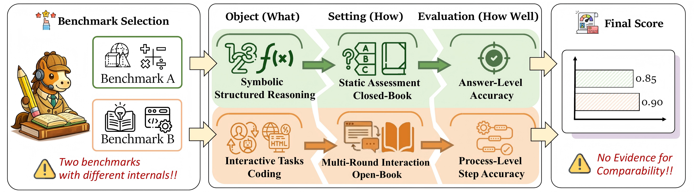
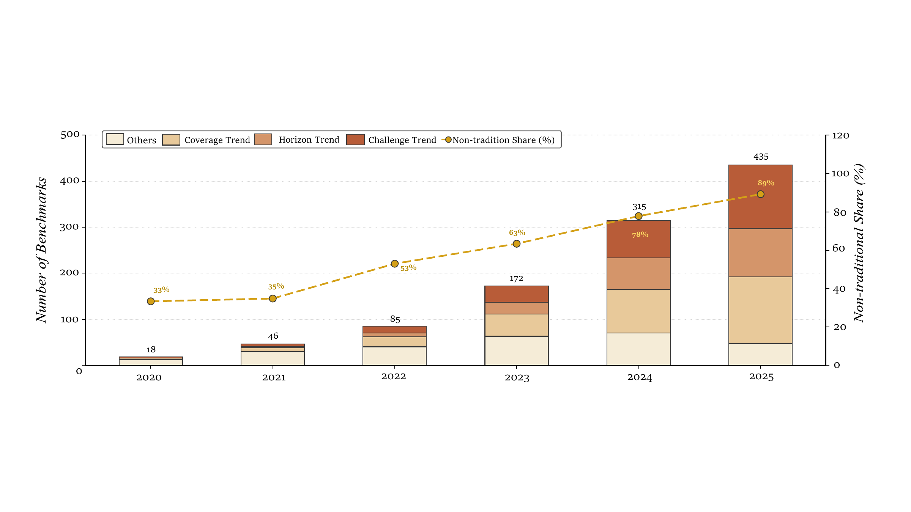
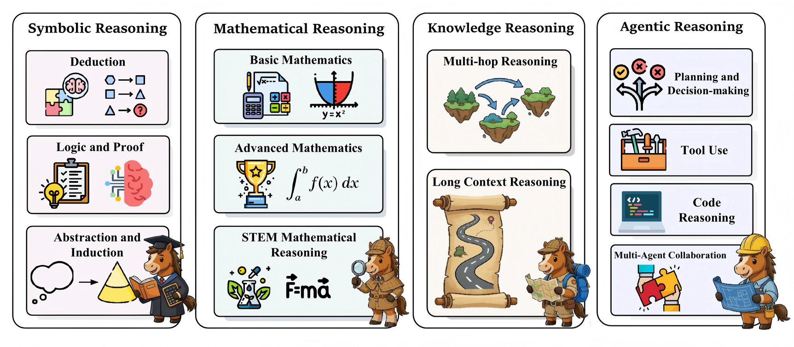
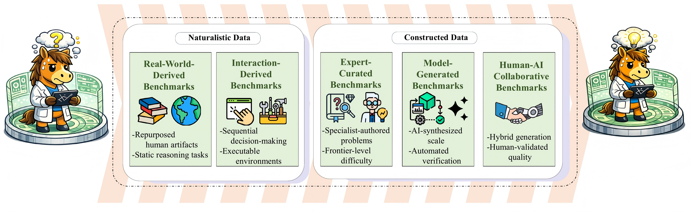
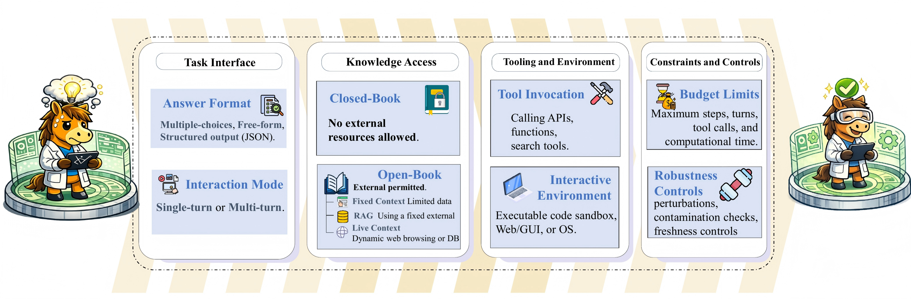
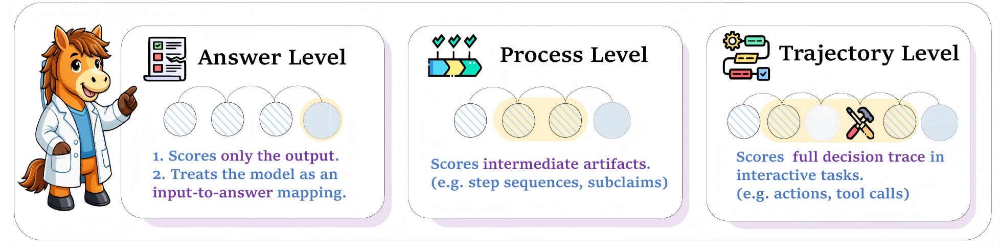
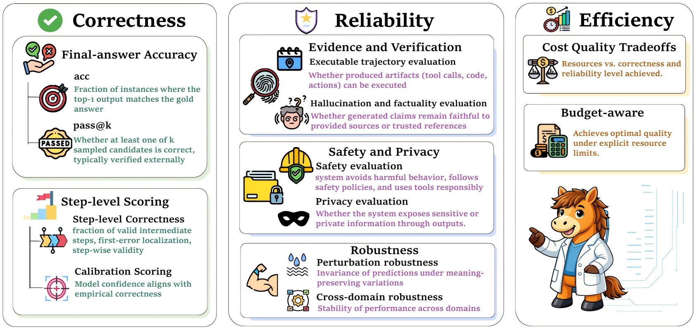
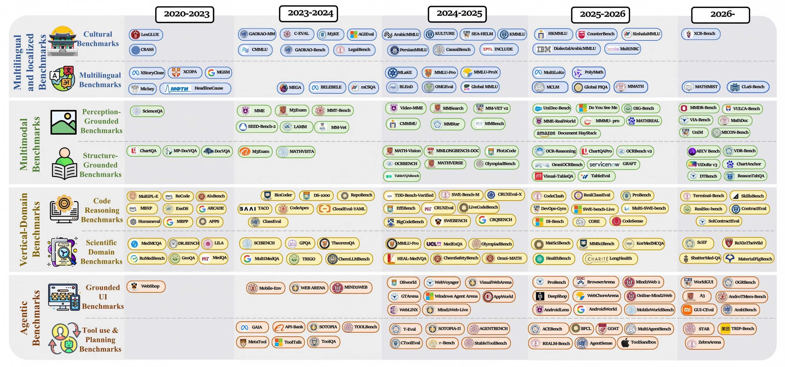
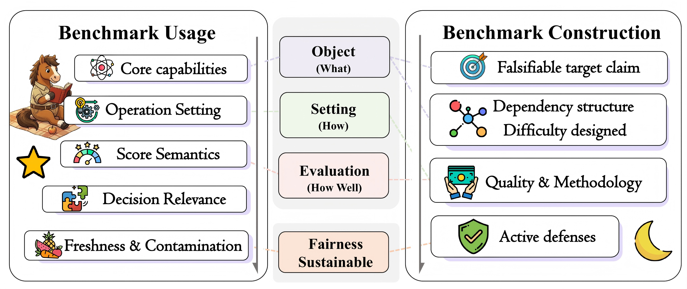
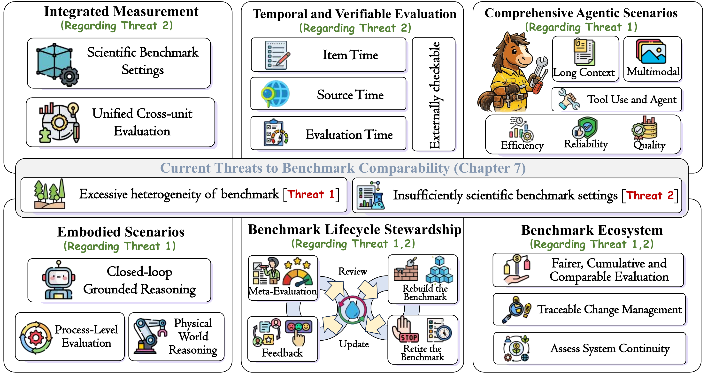



# 🧭 Rethinking Benchmark Comparability
### A Survey of Reasoning Benchmarks for Large Language Models

  
  
  
  
  

**A companion repository for reasoning benchmark selection, comparison, construction, and reporting.**

[📄 Paper](./scis_paper.pdf) |
[✨ Introduction](#introduction) |
[🧩 Framework](#framework) |
[📚 Content](#content) |
[🗂️ Benchmark List](#object-what-reasoning-capabilities-of-reasoning-benchmarks)

# 📢 News

- 2026.05: README layout refreshed with paper figures and a clearer repository guide.
- 2026.05: Companion PDF and benchmark index are available in this repository.

# ✨ Introduction

This repository accompanies the survey paper *Rethinking Benchmark Comparability: A Survey of Reasoning Benchmarks for Large Language Models*. As reasoning becomes a defining capability of large language models, reasoning benchmarks have moved to the center of evaluation. Yet benchmark results are often not directly comparable: benchmarks may differ in the capabilities they target, the conditions under which models are evaluated, and the criteria used to assess success.

Rather than treating benchmark scores as directly comparable by default, this repository organizes reasoning benchmarks through three complementary dimensions: **Object**, **Setting**, and **Evaluation**.

Reasoning benchmarks have expanded rapidly after 2023, with a visible shift from short, static QA-style tasks toward broader, longer-horizon, and more application-oriented benchmark designs. This growth increases coverage, but it also makes score comparison harder unless benchmark objects, settings, and evaluation criteria are made explicit.

The survey frames benchmark comparability as a scientific problem in how reasoning benchmarks are produced, interpreted, and used:

1. **🎯 Object** asks what reasoning capability a benchmark is designed to measure.
2. **🛠️ Setting** asks what data provenance, protocol formulation, scenario assumptions, and construction choices shape model behavior.
3. **📏 Evaluation** asks what observation unit, assessment dimension, and scoring protocol define success.

# 🧩 Framework

The benchmark framework is organized around three linked dimensions.

**🎯 Object.** Reasoning benchmark objects are grouped into symbolic, mathematical, knowledge, and agentic reasoning.

| Data Provenance | Protocol Formulation |
| :--: | :--: |
|  |  |

**🛠️ Setting.** Benchmark construction is described through data provenance and protocol formulation, including task interface, knowledge access, tooling and environment, and constraints and controls.

| Evaluation Units | Evaluation Dimensions |
| :--: | :--: |
|  |  |

**📏 Evaluation.** Assessment is organized by evaluation units and evaluation dimensions, moving beyond final-answer accuracy toward process-level and trajectory-level evidence.

# 📚 Content

The repository is organized as a paper-facing guide plus a benchmark index.

| Part | Entry |
| :-- | :-- |
| Paper | [Read the PDF](./scis_paper.pdf) |
| Object | [Reasoning Capabilities](#object-what-reasoning-capabilities-of-reasoning-benchmarks) |
| Setting | [Benchmark Construction](#setting-how-construction-of-reasoning-benchmarks) |
| Evaluation | [Assessment Protocols](#evaluation-how-well-assessment-of-reasoning-benchmarks) |
| Scenarios | [Scenario-Based Extensions](#scenario-based-extensions-of-reasoning-benchmarks-analysis) |

The survey extends the Object-Setting-Evaluation framework to recurring deployment-oriented contexts: multilingual and cultural benchmarks, multimodal benchmarks, vertical-domain benchmarks, and agentic and interactive benchmarks. These scenarios do not replace the core framework; they help interpret how benchmark assumptions change when language coverage, modality, domain, or interaction environment becomes central.

The practical guideline section connects benchmark usage and benchmark construction. For benchmark selection, the key question is whether a benchmark provides decision-relevant evidence for the intended model claim. For benchmark construction, the key question is whether the object, setting, evaluation protocol, and fairness assumptions are explicit enough to make results interpretable and reproducible.

# 📝 Repository Notes

- It serves as the companion resource for the survey paper rather than a generic benchmark dump.
- It emphasizes benchmark comparability, not score accumulation alone.
- It links each entry to the original **Paper** and the most relevant official **resource** page whenever available.
- It keeps the paper list organized as an index, while the figures above summarize the manuscript's framework and practical message.

# 🧭 Navigation

1. Start from **Object** if your question is *what kind of reasoning is being tested*.  
2. Start from **Setting** if your question is *how the benchmark was built and what assumptions it encodes*.  
3. Start from **Evaluation** if your question is *how success is measured and whether reported results are comparable*.  

# 📌 Citation

Zhang,  C., Liu,  S., Li,  H., Gao,  T., Wang,  Y., Chen,  Q., Feng,  X., Cai,  L., Du,  M., Tian,  Z., Qin,  L., Yu,  P. S., & Zhang,  M. (2026). Rethinking Benchmark Comparability: A Survey of Reasoning Benchmarks for Large Language Models. Preprints. https://doi.org/10.20944/preprints202605.0806.v1

---

##  Object (What): Reasoning Capabilities of Reasoning Benchmarks

### Symbolic Reasoning

#### Deduction

##### Rule-Based Chain Reasoning

| Date | Title | Paper | resource |
| :-----: | :--------------------------------------------------------------------------------------------------------------- | :--------------------------------------------------------------------------------------------------------------------------------------: | :---------: |
| 2025-11 | EngChain: A Symbolic Benchmark for Verifiable Multi-Step Reasoning in Engineering                                |  |   |
| 2025-03 | CoMT: A Novel Benchmark for Chain of Multi-modal Thought on Large Vision-Language Models|  |  |
| 2024-06 | Multi-LogiEval: Towards Evaluating Multi-Step Logical Reasoning Ability of Large Language Models                 |    |   |
| 2024-04 | LogicBench: Towards Systematic Evaluation of Logical Reasoning Ability of Large Language Models                  |    |  |
| 2024-01 | LogicAsker: Evaluating and Improving the Logical Reasoning Ability of Large Language Models                      |    |   |
| 2023-10 | Towards LogiGLUE: A Brief Survey and A Benchmark for Analyzing Logical Reasoning Capabilities of Language Models |  |   |
| 2022-10 | LANGUAGE MODELS ARE GREEDY REASONERS:A SYSTEMATIC FORMAL ANALYSIS OF CHAIN-OFTHOUGHT(PRONTOQA)                 |    |  |
| 2022-09 | FOLIO: Natural Language Reasoning with First-Order Logic     |    |   |
| 2021-04 | AR-LSAT: Investigating Analytical Reasoning of Text     |    |   |
| 2021-04 | Explaining Answers with Entailment Trees(ENTAILMENTBANK)                                                       |    |   |
| 2025-11 | EngChain: A Symbolic Benchmark for Verifiable Multi-Step Reasoning in Engineering |  |  |
| 2024-06 | Multi-LogiEval: Towards Evaluating Multi-Step Logical Reasoning Ability of Large Language Models |  |  |
| 2024-04 | LogicBench: Towards Systematic Evaluation of Logical Reasoning Ability of Large Language Models |  |  |
| 2024-01 | LogicAsker: Evaluating and Improving the Logical Reasoning Ability of Large Language Models |  |  |
| 2023-10 | Towards LogiGLUE: A Brief Survey and A Benchmark for Analyzing Logical Reasoning Capabilities of Language Models |  |  |
| 2022-10 | LANGUAGE MODELS ARE GREEDY REASONERS:A SYSTEMATIC FORMAL ANALYSIS OF CHAIN-OFTHOUGHT(PRONTOQA) |  |  |
| 2022-09 | FOLIO: Natural Language Reasoning with First-Order Logic |  |  |
| 2021-04 | AR-LSAT: Investigating Analytical Reasoning of Text |  |  |
| 2021-04 | Explaining Answers with Entailment Trees(ENTAILMENTBANK) |  |  |

##### Constraint Satisfaction and Interactive Games

| Date | Title | Paper | resource |
| :-----: | :--------------------------------------------------------------------------------------------------------------- | :--------------------------------------------------------------------------------------------------------------------------------------: | :---------: |
| 2026-01 | ChaosBench-Logic: A Benchmark for Logical and Symbolic Reasoning on Chaotic Dynamical Systems |  |  |
| 2025-05 | SATBench: Benchmarking LLMs' Logical Reasoning via Automated Puzzle Generation from SAT Formulas |  |  |
| 2025-05 | SynLogic: Synthesizing Verifiable Reasoning Data at Scale for Learning Logical Reasoning and Beyond |  |  |
| 2025-02 | BIG-Bench Extra Hard |  |  |
| 2025-02 | AutoLogi: Automated Generation of Logic Puzzles for Evaluating Reasoning Abilities of Large Language Models |  |  |
| 2024-08 | LogicGame: Benchmarking Rule-Based Reasoning Abilities of Large Language Models |  |  |
| 2022-06 | MINEDOJO: Building Open-Ended Embodied Agents with Internet-Scale Knowledge |  |  |
| 2022-03 | SCIENCEWORLD: Is your Agent Smarter than a 5th Grader? |  |  |
| 2022-02 | DialFRED: Dialogue-Enabled Agents for Embodied Instruction Following |  |  |

#### Logic and Proof

##### Formalization of Natural Language

| Date | Title | Paper | resource |
| :-----: | :--------------------------------------------------------------------------------------------------------------- | :--------------------------------------------------------------------------------------------------------------------------------------: | :---------: |
| 2026-01 | ChaosBench-Logic: A Benchmark for Logical and Symbolic Reasoning on Chaotic Dynamical Systems |  |  |
| 2025-09 | INABHYD:Language Models Do Not Follow Occam’s Razor:A Benchmark for Inductive and Abductive Reasoning |  |  |
| 2024-10 | P-FOLIO: Evaluating and Improving Logical Reasoning with Abundant Human-Written Reasoning Chains |  |  |
| 2024-06 | Multi-LogiEval: Towards Evaluating Multi-Step Logical Reasoning Ability of Large Language Models |  |  |
| 2024-05 | Autoformalizing Natural Language to First-Order Logic:A Case Study in Logical Fallacy Detection(NL2FOL) |  |  |
| 2024-03 | Towards Automatic Composition of ASP Programs from Natural Language Specifications |  |  |
| 2022-10 | Language Models Are Greedy Reasoners: A Systematic Formal Analysis of Chain-of-Thought |  |  |
| 2022-09 | FOLIO: Natural Language Reasoning with First-Order Logic |  |  |
| 2022-03 | LOGICINFERENCE: A NEW DATASET FOR TEACHING LOGICAL INFERENCE TO SEQ2SEQ MODELS |  |  |
| 2022-02 | Logical Fallacy Detection |  |  |
| 2021-11 | Diagnosing the First-Order Logical Reasoning Ability Through LogicNLI |  |  |
| 2021-09 | MINIF2F: A CROSS-SYSTEM BENCHMARK FOR FORMAL OLYMPIAD-LEVEL MATHEMATICS |  |  |

##### Proof Generation
| Date | Title | Paper | resource |
| :-----: | :--------------------------------------------------------------------------------------------------------------- | :--------------------------------------------------------------------------------------------------------------------------------------: | :---------: |
| 2021-04 | NATURALPROOFS: Mathematical Theorem Proving in Natural Language |  |  |
| 2021-05 | Inter-GPS: Interpretable Geometry Problem Solving with Formal Language and Symbolic Reasoning(Geometry3K ) |  |  |
| 2021-09 | MINIF2F: A CROSS-SYSTEM BENCHMARK FOR FORMAL OLYMPIAD-LEVEL MATHEMATICS |  |  |
| 2023-02 | ProofNet: Autoformalizing and Formally Proving Undergraduate-Level Mathematics |  |  |
| 2024-12 | ProcessBench: Identifying Process Errors in Mathematical Reasoning |  |  |
| 2026-01 | Neural Theorem Proving for Verification Conditions: A Real-World Benchmark(NTP4VC​) |  |  |

##### Proof verification and interactive proof

| Date | Title | Paper | resource |
| :-----: | :--------------------------------------------------------------------------------------------------------------- | :--------------------------------------------------------------------------------------------------------------------------------------: | :---------: |
| 2021-09 | MINIF2F: A CROSS-SYSTEM BENCHMARK FOR FORMAL OLYMPIAD-LEVEL MATHEMATICS |  |  |
| 2024-07 | PUTNAMBENCH: Evaluating Neural Theorem-Provers on the Putnam Mathematical Competition |  |  |
| 2025-05 | FormalMATH: Benchmarking Formal Mathematical Reasoning of Large Language Models |  |  |
| 2025-07 | VeriBench: End-to-End Formal Verification Benchmark for AI Code Generation in Lean 4 |  |  |
| 2025-10 | VeriBench-FTP: A Formal Theorem Proving Benchmark in Lean 4 for Code Verification |  |  |
| 2025-10 | VERIEQUIVBENCH: AN EQUIVALENCE SCORE FOR GROUND-TRUTH-FREE EVALUATION OF FORMALLY VERIFIABLE CODE |  |  |
| 2025-10 | HARD2VERIFY: A STEP-LEVEL VERIFICATION BENCHMARK FOR OPEN-ENDED FRONTIER MATH |  | -

#### Abstraction and Induction

##### Combinatorial generalization and systematic generalization

| Date | Title | Paper | resource |
| :-----: | :--------------------------------------------------------------------------------------------------------------- | :--------------------------------------------------------------------------------------------------------------------------------------: | :---------: |
| 2021-09  | Systematic Generalization on gSCAN:What is Nearly Solved and What is Next?   |  |   |
| 2021-11  | Grounded Graph Decoding Improves Compositional Generalization in Question Answering    |  |   |
| 2023-05  |The ConceptARC Benchmark:Evaluating Understanding and Generalization in the ARC Domain  |  |   |
| 2023-10  | SLOG: A Structural Generalization Benchmark for Semantic arsing      |  |   |
| 2024-10  | Tackling the Abstraction and Reasoning Corpus with Vision Transformers: the Importance of 2D Representation, Positions, and Objects  |  |   |
| 2024-12  | NeSyCoCo: A Neuro-Symbolic Concept Composer for Compositional Generalization |  |   |
| 2025-07 | MPCC: A Novel Benchmark for Multimodal Planning with Complex Constraints in Multimodal Large Language Models |  |   |
| 2021-09 | Systematic Generalization on gSCAN:What is Nearly Solved and What is Next? |  |  |
| 2021-11 | Grounded Graph Decoding Improves Compositional Generalization in Question Answering |  |  |
| 2023-05 | The ConceptARC Benchmark:Evaluating Understanding and Generalization in the ARC Domain |  |  |
| 2023-10 | SLOG: A Structural Generalization Benchmark for Semantic arsing |  |  |
| 2024-10 | Tackling the Abstraction and Reasoning Corpus with Vision Transformers: the Importance of 2D Representation, Positions, and Objects |  |  |
| 2024-12 | NeSyCoCo: A Neuro-Symbolic Concept Composer for Compositional Generalization |  |  |
| 2025-06 | EasyARC: Evaluating Vision Language Models on True Visual Reasoning |  |  |
| 2025-07 | CompoST: A Benchmark for Analyzing the Ability of LLMs To Compositionally Interpret Questions in a QALD Setting |  |  |
| 2025-11 | DecompSR: A dataset for decomposed analyses of compositional multihop spatial reasoning |  | -

##### Rule induction and program synthesis

| Date | Title | Paper | resource |
| :-----: | :--------------------------------------------------------------------------------------------------------------- | :--------------------------------------------------------------------------------------------------------------------------------------: | :---------: |
| 2021-05 | Measuring Coding Challenge Competence With APPS |  |  |
| 2024-10 | Tackling the Abstraction and Reasoning Corpus with Vision Transformers: the Importance of 2D Representation, Positions, and Objects |  |  |
| 2024-12 | HumanEval Pro and MBPP Pro: Evaluating Large Language Models son Self-invoking Code Generation |  |  |
| 2025-03 | CodeARC: Benchmarking Reasoning Capabilities of LLM Agents for Inductive Program Synthesis |  |  |
| 2025-05 | Legal Rule Induction: Towards Generalizable Principle Discovery from Analogous Judicial Precedents |  |  |

### Mathematical Reasoning

#### Basic Mathematics  

##### General Basic Mathematics 

| Date | Title | Paper | resource |
| :-----: | :--------------------------------------------------------------------------------------------------------------- | :--------------------------------------------------------------------------------------------------------------------------------------: | :---------: |
| 2024-10 | GSM-SYMBOLIC: UNDERSTANDING THE LIMITATIONS OF MATHEMATICAL REASONING IN LARGE LANGUAGE MODELS |  |  |
| 2024-06 | MMLU-Pro: A More Challenging and Discriminative Massive Multitask Language Understanding Benchmark |  |  |
| 2024-05 | MathBench: A Comprehensive Multi-level Benchmark for Evaluating Mathematical Capabilities |  |  |
| 2024-05 | A Careful Examination of Large Language Model Performance on Grade School Arithmetic(GSM1k) |  |  |
| 2022-11 | PAL: Program-aided Language Models(GSM-HARD) |  |  |
| 2021-10 | Grade School Math 8K(GSM8K​) |  |  |
| 2021-03 | Are NLP Models really able to Solve Simple Math Word Problems? |  |  |
| 2021-03 | AMPS: Measuring Mathematical Problem Solving With the MATH Dataset |  |  |

##### Adversarially Robust Mathematics  
| Date | Title | Paper | resource |
| :-----: | :--------------------------------------------------------------------------------------------------------------- | :--------------------------------------------------------------------------------------------------------------------------------------: | :---------: |
| 2024-02 | GSM-Plus: A Comprehensive Benchmark for Evaluating the Robustness of LLMs as Mathematical Problem Solvers |  |  |
| 2024-05 | A Careful Examination of Large Language Model Performance on Grade School Arithmetic(GSM1k) |  |  |
| 2024-06 | LiveBench: A Difficult LLM Benchmark Consisting of Frequently-Updated Questions |  |  |
| 2024-10 | GSM-SYMBOLIC: UNDERSTANDING THE LIMITATIONS OF MATHEMATICAL REASONING IN LARGE LANGUAGE MODELS |  |  |
| 2024-12 | Are Your LLMs Capable of Stable Reasoning?(livemathbench) |  |  |
| 2025-05 | MathArena: Evaluating LLMs on Uncontaminated Math Competitions |  |  |
| 2025-08 | ASyMOB: Algebraic Symbolic Mathematical Operations Benchmark |  |  |
| 2025-10 | MATHEMAGIC: Generating Dynamic Mathematics Benchmarks Robust to Memorization |  |  |

##### Arithmetic and algebra

| Date | Title | Paper | resource |
| :-----: | :--------------------------------------------------------------------------------------------------------------- | :--------------------------------------------------------------------------------------------------------------------------------------: | :---------: |
| 2021-03 | Are NLP Models really able to Solve Simple Math Word Problems? |  |  |
| 2021-06 | A Diverse Corpus for Evaluating and Developing English Math Word Problem Solvers |  |  |
| 2021-10 | Grade School Math 8K(GSM8K​) |  |  |
| 2023-04 | AGIEval: A Human-Centric Benchmark for Evaluating Foundation Models |  |  |

##### Geometry and discrete

| Date | Title | Paper | resource |
| :-----: | :--------------------------------------------------------------------------------------------------------------- | :--------------------------------------------------------------------------------------------------------------------------------------: | :---------: |
| 2021-05 | Inter-GPS: Interpretable Geometry Problem Solving with Formal Language and Symbolic Reasoning(Geometry3K ) |  |  |
| 2021-05 | GeoQA: A Geometric Question Answering Benchmark Towards Multimodal Numerical Reasoning |  |  |
| 2024-03 | ARE LANGUAGE MODELS PUZZLE PRODIGIES? Algorithmic Puzzles Unveil Serious Challenges in Multimodal Reasoning |  |  |
| 2025-05 | FormalMATH: Benchmarking Formal Mathematical Reasoning of Large Language Models |  |  |
| 2025-08 | LEANGEO: FORMALIZING COMPETITIONAL GEOMETRY PROBLEMS IN LEAN |  |  |
| 2025-09 | Euclid’s Gift: Enhancing Spatial Perception and Reasoning in Vision-Language Models via Geometric Surrogate Tasks |  |  |
| 2025-10 | AMO-Bench: Large Language Models Still Struggle in High School Math Competitions |  |  |
| 2025-12 | Gold-Medal-Level Olympiad Geometry Solving with Efficient Heuristic Auxiliary Constructions |  |  |

##### Probability, statistics, and uncertainty
| Date | Title | Paper | resource |
| :-----: | :--------------------------------------------------------------------------------------------------------------- | :--------------------------------------------------------------------------------------------------------------------------------------: | :---------: |
| 2021-03 | Measuring Mathematical Problem Solving With the MATH Dataset |  |  |
| 2025-01 | UGMATHBENCH: A DIVERSE AND DYNAMIC BENCHMARK FOR UNDERGRADUATE-LEVEL MATHEMATICAL REASONING WITH LARGE LANGUAGE MODELS |  |  |
| 2025-10 | SKYLENAGE Technical Report: Mathematical Reasoning and Contest-Innovation Benchmarks for Multi-Level Math Evaluation |  |  |
| 2025-12 | Nemotron-Math: Efficient Long-Context Distillation of Mathematical Reasoning from Multi-Mode Supervision |  |  |

#### Advanced Mathematics

##### Competition Mathematics

| Date | Title | Paper | resource |
| :-----: | :--------------------------------------------------------------------------------------------------------------- | :--------------------------------------------------------------------------------------------------------------------------------------: | :---------: |
| 2026-04 | OMIBench: Benchmarking Olympiad-Level Multi-Image Reasoning in Large Vision-Language Model|  | Update Soon|
| 2025-11 | Towards Robust Mathematical Reasoning             |  |  |
| 2025-10  | SKYLENAGE Technical Report: Mathematical Reasoning and Contest-Innovation Benchmarks for Multi-Level Math Evaluation   |  |   |
| 2025-10  | AMO-Bench: Large Language Models Still Struggle in High School Math Competitions |  |   |
| 2025-08 | Putnam-AXIOM: A Functional & Static Benchmark for Measuring Higher Level Mathematical Reasoning in LLMs               |  |  |
| 2025-05  | MathArena: Evaluating LLMs on Uncontaminated Math Competitions   |  |   |
| 2025-03 | OlymMATH: A Novel Olympiad-level Mathematical Benchmark         |  |   |
| 2024-10 | Omni-MATH: A Universal Olympiad-level Mathematic Benchmark for Large Language Models                                  |  |   |
| 2024-07  | PUTNAMBENCH: Evaluating Neural Theorem-Provers on the Putnam Mathematical Competition  |  |  |
| 2024-02 | OlympiadBench: A Challenging Benchmark for Promoting AGI with Olympiad-level Bilingual Multimodal Scientific Problems |  |  |
| 2025-11 | Towards Robust Mathematical Reasoning |  |  |
| 2025-10 | SKYLENAGE Technical Report: Mathematical Reasoning and Contest-Innovation Benchmarks for Multi-Level Math Evaluation |  |  |
| 2025-10 | AMO-Bench: Large Language Models Still Struggle in High School Math Competitions |  |  |
| 2025-05 | MathArena: Evaluating LLMs on Uncontaminated Math Competitions |  |  |
| 2025-03 | OlymMATH: A Novel Olympiad-level Mathematical Benchmark |  |  |
| 2024-10 | Omni-MATH: A Universal Olympiad-level Mathematic Benchmark for Large Language Models |  |  |
| 2024-07 | PUTNAMBENCH: Evaluating Neural Theorem-Provers on the Putnam Mathematical Competition |  |  |
| 2024-02 | OlympiadBench: A Challenging Benchmark for Promoting AGI with Olympiad-level Bilingual Multimodal Scientific Problems |  |  |

##### Spectral Mathematics
| Date | Title | Paper | resource |
| :-----: | :--------------------------------------------------------------------------------------------------------------- | :--------------------------------------------------------------------------------------------------------------------------------------: | :---------: |
| 2025-05 | MathArena: Evaluating LLMs on Uncontaminated Math Competitions |  |  |
| 2025-05 | FormalMATH: Benchmarking Formal Mathematical Reasoning of Large Language Models |  |  |
| 2025-01 | UGMATHBENCH: A DIVERSE AND DYNAMIC BENCHMARK FOR UNDERGRADUATE-LEVEL MATHEMATICAL REASONING WITH LARGE LANGUAGE MODELS |  |  |
| 2024-06 | MMLU-Pro: A More Challenging and Discriminative Massive Multitask Language Understanding Benchmark |  |  |
| 2024-06 | LiveBench: A Difficult LLM Benchmark Consisting of Frequently-Updated Questions |  |  |
| 2024-05 | MathBench: A Comprehensive Multi-level Benchmark for Evaluating Mathematical Capabilities |  |  |
| 2023-11 | GPQA: A Graduate-Level Google-Proof Q&A Benchmark |  |  |
| 2023-10 | MATHVISTA: EVALUATING MATHEMATICAL REASONING OF FOUNDATION MODELS IN VISUAL CONTEXTS |  |  |

### STEM Mathematical Reasoning

| Date | Title | Paper | resource |
| :-----: | :--------------------------------------------------------------------------------------------------------------- | :--------------------------------------------------------------------------------------------------------------------------------------: | :---------: |
| 2026-04 | OMIBench: Benchmarking Olympiad-Level Multi-Image Reasoning in Large Vision-Language Model|  |Update Soon |
| 2024-05 |M^3CoT: ANovel Benchmark for Multi-Domain Multi-step Multi-modal Chain-of-Thought|  |  |

### Knowledge Reasoning

#### Multi-hop Reasoning
##### Multi-hop Answering

| Date | Title | Paper | resource |
| :-----: | :--------------------------------------------------------------------------------------------------------------- | :--------------------------------------------------------------------------------------------------------------------------------------: | :---------: |
| 2026-04 | OMIBench: Benchmarking Olympiad-Level Multi-Image Reasoning in Large Vision-Language Model|  |Update Soon |
| 2026-01  | Retrieval-Infused Reasoning Sandbox: A Benchmark for Decoupling Retrieval and Reasoning Capabilities|  |  |
| 2025-03 | CoMT: A Novel Benchmark for Chain of Multi-modal Thought on Large Vision-Language Models|  |  |
| 2024-12 | MINTQA: A Multi-Hop Question Answering Benchmark for Evaluating LLMs on New and Tail Knowledge                |  |  |
| 2024-05 |M^3CoT: ANovel Benchmark for Multi-Domain Multi-step Multi-modal Chain-of-Thought|  |  |
| 2024-01 | MultiHop-RAG: Benchmarking Retrieval-Augmented Generation for Multi-Hop Queries                               |    |   |
| 2023-10 | FRESHLLMS:REFRESHING LARGE LANGUAGE MODELS WITH SEARCH ENGINE AUGMENTATION                                    |    |  |
| 2022-10 | WIKIWHY: ANSWERING AND EXPLAINING CAUSE-AND-EFFECT QUESTIONS                                                  |    |  |
| 2022-05 | QAMPARI: An Open-domain Question Answering Benchmark for Questions with Many Answers from Multiple Paragraphs |    |  |
| 2021-08 | MuSiQue: Multihop Question Answering Over Multiple Paragraphs                                                 |    |  |
| 2021-04 | MULTIMODALQA: COMPLEX QUESTION ANSWERING OVER TEXT, TABLES AND IMAGES                                         |    |  |
| 2021-01 | Did Aristotle Use a Laptop? A Question Answering Benchmark with Implicit Reasoning Strategies                 |    |  |
| 2024-12 | MINTQA: A Multi-Hop Question Answering Benchmark for Evaluating LLMs on New and Tail Knowledge |  |  |
| 2024-01 | MultiHop-RAG: Benchmarking Retrieval-Augmented Generation for Multi-Hop Queries |  |  |
| 2023-10 | FRESHLLMS:REFRESHING LARGE LANGUAGE MODELS WITH SEARCH ENGINE AUGMENTATION |  |  |
| 2022-10 | WIKIWHY: ANSWERING AND EXPLAINING CAUSE-AND-EFFECT QUESTIONS |  |  |
| 2022-05 | QAMPARI: An Open-domain Question Answering Benchmark for Questions with Many Answers from Multiple Paragraphs |  |  |
| 2021-08 | MuSiQue: Multihop Question Answering Over Multiple Paragraphs |  |  |
| 2021-04 | MULTIMODALQA: COMPLEX QUESTION ANSWERING OVER TEXT, TABLES AND IMAGES |  |  |
| 2021-01 | Did Aristotle Use a Laptop? A Question Answering Benchmark with Implicit Reasoning Strategies |  |  |

##### Multi-hop Retrieval

| Date | Title | Paper | resource |
| :-----: | :--------------------------------------------------------------------------------------------------------------- | :--------------------------------------------------------------------------------------------------------------------------------------: | :---------: |
| 2026-01  | Retrieval-Infused Reasoning Sandbox: A Benchmark for Decoupling Retrieval and Reasoning Capabilities|  |  |
| 2026-01 | TEMPO: A Realistic Multi-Domain Benchmark for Temporal Reasoning-Intensive Retrieval |  |  |
| 2024-01 | MultiHop-RAG: Benchmarking Retrieval-Augmented Generation for Multi-Hop Queries                               |    |   |
| 2023-11 | GAIA: a benchmark for General AI Assistants                                          |  |   |
| 2022-03 | REASONING OVER PUBLIC AND PRIVATE DATA IN RETRIEVAL-BASED SYSTEMS(CONCURRENTQA)      |  | |
| 2026-01 | TEMPO: A Realistic Multi-Domain Benchmark for Temporal Reasoning-Intensive Retrieval |  |  |
| 2024-01 | MultiHop-RAG: Benchmarking Retrieval-Augmented Generation for Multi-Hop Queries |  |  |
| 2023-11 | GAIA: a benchmark for General AI Assistants |  |  |
| 2022-03 | REASONING OVER PUBLIC AND PRIVATE DATA IN RETRIEVAL-BASED SYSTEMS(CONCURRENTQA) |  |  |

#### Long-context Reasoning

##### Long-horizon Tasks

| Date | Title | Paper | resource |
| :-----: | :--------------------------------------------------------------------------------------------------------------- | :--------------------------------------------------------------------------------------------------------------------------------------: | :---------: |
| 2025-10 | LC-Eval: A Bilingual Multi-Task Evaluation Benchmark for Long-Context Understanding               |               |   |
| 2025-07 | MPCC: A Novel Benchmark for Multimodal Planning with Complex Constraints in Multimodal Large Language Models |  |   |
| 2025-05 | X-WebAgentBench: A Multilingual Interactive Web Benchmark for Evaluating Global Agentic System                                |  |   |
| 2025-05 | 100-LongBench: Are de facto Long-Context Benchmarks Literally Evaluating Long-Context Ability?    |             |  |
| 2024-12 | LongBench v2: Towards Deeper Understanding and Reasoning on Realistic Long-context Multitasks     |               |   |
| 2024-10 | LONGGENBENCH: Long-context Generation Benchmark                                                   |               |  |
| 2024-10 | HELMET: HOW TO EVALUATE LONG-CONTEXT LANGUAGE MODELS EFFECTIVELY AND THOROUGHLY                   |               |  |
| 2024-06 | BABILong: Testing the Limits of LLMs with Long Context Reasoning-in-a-Haystack                    |               |  |
| 2024-05 |M^3CoT: ANovel Benchmark for Multi-Domain Multi-step Multi-modal Chain-of-Thought|  |  |
| 2024-04 | Ada-LEval: A Length-Adaptable Benchmark for Evaluating the Long-Context Understanding of LLMs     |               |  |
| 2024-04 | RULER: What’s the Real Context Size of Your Long-Context Language Models?                         |               |  |
| 2024-02 | ∞BENCH: Extending Long Context Evaluation Beyond 100K Tokens                                      |             |  |
| 2023-11 | FINANCEBENCH: A New Benchmark for Financial Question Answering                                    |               |  |
| 2023-08 | LongBench: A Bilingual, Multitask Benchmark for Long Context Understanding      |  |   |
| 2023-05 | VCSUM: A Versatile Chinese Meeting Summarization Dataset                                          |               |  |
| 2023-04 | LongForm: Effective Instruction Tuning with Reverse Instructions                                  |               |  |
| 2022-02 | MuLD: The Multitask Long Document Benchmark                                                       |               |  |
| 2022-01 | SCROLLS: Standardized CompaRison Over Long Language Sequences                                     |               |  |
| 2025-10 | LC-Eval: A Bilingual Multi-Task Evaluation Benchmark for Long-Context Understanding |  |  |
| 2025-05 | LongLeader: A Comprehensive Leaderboard for Large Language Models in Long-context Scenarios |  |  |
| 2025-05 | 100-LongBench: Are de facto Long-Context Benchmarks Literally Evaluating Long-Context Ability? |  |  |
| 2025-02 | DocPuzzle: A Process-Aware Benchmark for Evaluating Realistic Long-Context Reasoning Capabilities |  | Update Soon |
| 2024-12 | LongBench v2: Towards Deeper Understanding and Reasoning on Realistic Long-context Multitasks |  |  |
| 2024-10 | LONGGENBENCH: Long-context Generation Benchmark |  |  |
| 2024-10 | HELMET: HOW TO EVALUATE LONG-CONTEXT LANGUAGE MODELS EFFECTIVELY AND THOROUGHLY |  |  |
| 2024-06 | BABILong: Testing the Limits of LLMs with Long Context Reasoning-in-a-Haystack |  |  |
| 2024-04 | Ada-LEval: A Length-Adaptable Benchmark for Evaluating the Long-Context Understanding of LLMs |  |  |
| 2024-04 | RULER: What’s the Real Context Size of Your Long-Context Language Models? |  |  |
| 2024-02 | ∞BENCH: Extending Long Context Evaluation Beyond 100K Tokens |  |  |
| 2023-11 | FINANCEBENCH: A New Benchmark for Financial Question Answering |  |  |
| 2023-08 | LongBench: A Bilingual, Multitask Benchmark for Long Context Understanding |  |  |
| 2023-05 | VCSUM: A Versatile Chinese Meeting Summarization Dataset |  |  |
| 2023-04 | LongForm: Effective Instruction Tuning with Reverse Instructions |  |  |
| 2022-02 | MuLD: The Multitask Long Document Benchmark |  |  |
| 2022-01 | SCROLLS: Standardized CompaRison Over Long Language Sequences |  |  |

##### Distraction

| Date | Title | Paper | resource |
| :-----: | :--------------------------------------------------------------------------------------------------------------- | :--------------------------------------------------------------------------------------------------------------------------------------: | :---------: |
| 2023-07  | L-EVAL: INSTITUTING STANDARDIZED EVALUATION FOR LONG CONTEXT LANGUAGE MODELS                  |  |  |
| 2023-08 | LongBench: A Bilingual, Multitask Benchmark for Long Context Understanding      |  |   |
| 2024-03  | Long-form factuality in large language models(LongFact)                        |  |  |
| 2024-04 | Ada-LEval: A Length-Adaptable Benchmark for Evaluating the Long-Context Understanding of LLMs     |               |  |
| 2024-04 | RULER: What’s the Real Context Size of Your Long-Context Language Models?                         |               |  |
| 2024-06 | BABILong: Testing the Limits of LLMs with Long Context Reasoning-in-a-Haystack                    |               |  |
| 2024-07  | NeedleBench: A Comprehensive Synthetic Framework for Evaluating Retrieval and Reasoning Performance |  |  |
| 2024-07 | MMLongBench-Doc: Benchmarking Long-context Document Understanding with Visualizations                |  |  |
| 2024-02 | ∞BENCH: Extending Long Context Evaluation Beyond 100K Tokens                                      |             |  |
| 2024-10 | HELMET: HOW TO EVALUATE LONG-CONTEXT LANGUAGE MODELS EFFECTIVELY AND THOROUGHLY                   |               |  |
| 2025-05 | 100-LongBench: Are de facto Long-Context Benchmarks Literally Evaluating Long-Context Ability?    |             |  |
| 2026-04 | OMIBench: Benchmarking Olympiad-Level Multi-Image Reasoning in Large Vision-Language Model|  |Update Soon |
| 2023-07 | L-EVAL: INSTITUTING STANDARDIZED EVALUATION FOR LONG CONTEXT LANGUAGE MODELS |  |  |
| 2023-08 | LongBench: A Bilingual, Multitask Benchmark for Long Context Understanding |  |  |
| 2024-03 | Long-form factuality in large language models(LongFact) |  |  |
| 2024-04 | Ada-LEval: A Length-Adaptable Benchmark for Evaluating the Long-Context Understanding of LLMs |  |  |
| 2024-04 | RULER: What’s the Real Context Size of Your Long-Context Language Models? |  |  |
| 2024-06 | BABILong: Testing the Limits of LLMs with Long Context Reasoning-in-a-Haystack |  |  |
| 2024-07 | NeedleBench: A Comprehensive Synthetic Framework for Evaluating Retrieval and Reasoning Performance |  |  |
| 2024-07 | MMLongBench-Doc: Benchmarking Long-context Document Understanding with Visualizations |  |  |
| 2024-02 | ∞BENCH: Extending Long Context Evaluation Beyond 100K Tokens |  |  |
| 2024-10 | HELMET: HOW TO EVALUATE LONG-CONTEXT LANGUAGE MODELS EFFECTIVELY AND THOROUGHLY |  |  |
| 2025-05 | 100-LongBench: Are de facto Long-Context Benchmarks Literally Evaluating Long-Context Ability? |  |  |

##### Long-range State Reasoning

| Date | Title | Paper | resource |
| :-----: | :--------------------------------------------------------------------------------------------------------------- | :--------------------------------------------------------------------------------------------------------------------------------------: | :---------: |
| 2023-06  | MIND2WEB: Towards a Generalist Agent for the Web     |  |  |
| 2023-12  | EgoPlan-Bench: Benchmarking Multimodal Large Language Models for Human-Level Planning      |  |  |
| 2024-11  | PARTNR: A Benchmark for Planning and Reasoning in Embodied Multi-agent Tasks        |  |  |
| 2025-01  | R-HORIZON: How Far Can Your Large Reasoning Model Really Go in Breadth and Depth?       |  |  |
| 2025-03 | CoMT: A Novel Benchmark for Chain of Multi-modal Thought on Large Vision-Language Models|  |  |
| 2025-09  | SWE-Bench Pro: Can AI Agents Solve Long-Horizon Software Engineering Tasks?     |  |   |
| 2026-01  | SokoBench: Evaluating Long-Horizon Planning and Reasoning in Large Language Models          |   |
| 2026-01  | DEEPPLANNING: Benchmarking Long-Horizon Agentic Planning with Verifiable Constraints         |  |   |
| 2026-01  | Retrieval-Infused Reasoning Sandbox: A Benchmark for Decoupling Retrieval and Reasoning Capabilities|  |  |
| 2026-02  | LLM-WikiRace Benchmark: How Far Can LLMs Plan over Real-World Knowledge Graphs?     |  |  |
| 2026-02  | EcoGym: Evaluating LLMs for Long-Horizon Plan-and-Execute in Interactive Economies   |  |  |
| 2023-06 | MIND2WEB: Towards a Generalist Agent for the Web |  |  |
| 2023-12 | EgoPlan-Bench: Benchmarking Multimodal Large Language Models for Human-Level Planning |  |  |
| 2024-11 | PARTNR: A Benchmark for Planning and Reasoning in Embodied Multi-agent Tasks |  |  |
| 2025-01 | R-HORIZON: How Far Can Your Large Reasoning Model Really Go in Breadth and Depth? |  |  |
| 2025-09 | SWE-Bench Pro: Can AI Agents Solve Long-Horizon Software Engineering Tasks? |  |  |
| 2026-01 | SokoBench: Evaluating Long-Horizon Planning and Reasoning in Large Language Models | - |  |
| 2026-01 | DEEPPLANNING: Benchmarking Long-Horizon Agentic Planning with Verifiable Constraints |  |  |
| 2026-02 | TRIP-Bench: A Benchmark for Long-Horizon Interactive Agents in Real-World Scenarios |  |  |
| 2026-02 | LLM-WikiRace Benchmark: How Far Can LLMs Plan over Real-World Knowledge Graphs? |  |  |
| 2026-02 | EcoGym: Evaluating LLMs for Long-Horizon Plan-and-Execute in Interactive Economies |  |  |

### Agentic Reasoning

####  Planning and Decision-making

##### Web Navigation

| Date | Title | Paper | resource |
| :-----: | :--------------------------------------------------------------------------------------------------------------- | :--------------------------------------------------------------------------------------------------------------------------------------: | :---------: |
| 2025-06 | Mind2Web 2:Evaluating Agentic Search with Agent-as-a-Judge                                |  |   |
| 2025-05 | X-WebAgentBench: A Multilingual Interactive Web Benchmark for Evaluating Global Agentic System                                |  |   |
| 2025-05 | InfoDeepSeek: Benchmarking Agentic Information Seeking for Retrieval-Augmented Generation |  |   |
| 2025-04 | BrowseComp: A Simple Yet Challenging Benchmark for Browsing Agents                        |  |  |
| 2024-06 | WebCanvas: Benchmarking Web Agents in Online Environments                                 |  |  |
| 2024-01 | WebVoyager: Building an End-to-End Web Agent with Large Multimodal Models                 |  |  |
| 2023-11 | GAIA: a benchmark for General AI Assistants                                          |  |   |
| 2023-08 | AgentBench: A Comprehensive Benchmark to Evaluate LLMs as Agents                          |  |  |
| 2023-07 | WebArena: A Realistic Self-Hosted Web Environment for Building Autonomous Agents          |  |  |
| 2023-06  | MIND2WEB: Towards a Generalist Agent for the Web     |  |  |
| 2025-06 | Mind2Web 2:Evaluating Agentic Search with Agent-as-a-Judge |  |  |
| 2025-05 | InfoDeepSeek: Benchmarking Agentic Information Seeking for Retrieval-Augmented Generation |  |  |
| 2025-04 | BrowseComp: A Simple Yet Challenging Benchmark for Browsing Agents |  |  |
| 2024-06 | WebCanvas: Benchmarking Web Agents in Online Environments |  |  |
| 2024-01 | WebVoyager: Building an End-to-End Web Agent with Large Multimodal Models |  |  |
| 2023-11 | GAIA: a benchmark for General AI Assistants |  |  |
| 2023-08 | AgentBench: A Comprehensive Benchmark to Evaluate LLMs as Agents |  |  |
| 2023-07 | WebArena: A Realistic Self-Hosted Web Environment for Building Autonomous Agents |  |  |
| 2023-06 | MIND2WEB: Towards a Generalist Agent for the Web |  |  |

##### Interactive Environment

| Date | Title | Paper | resource |
| :-----: | :--------------------------------------------------------------------------------------------------------------- | :--------------------------------------------------------------------------------------------------------------------------------------: | :---------: |
| 2025-10 | HOLISTIC AGENT LEADERBOARD: THE MISSING INFRASTRUCTURE FOR AI AGENT EVALUATION(HAL)                               |  |  |
| 2025-05 | X-WebAgentBench: A Multilingual Interactive Web Benchmark for Evaluating Global Agentic System                                |  |   |
| 2025-05 | FieldWorkArena: Agentic AI Benchmark for Real Field Work Tasks                                                    |  |  |
| 2025-04 | PaperBench: Evaluating AI’s Ability to Replicate AI Research                                                      |  |  |
| 2025-01 | MedAgentBench: A Realistic Virtual EHR Environment to Benchmark Medical LLM Agents                                |  |  |
| 2024-07 | AppWorld: A Controllable World of Apps and People for Benchmarking Interactive Coding Agents                      |  |  |
| 2024-06 | τ-bench: A Benchmark for Tool-Agent-User Interaction in Real-World Domains                                        |  |  |
| 2024-05 | AgentClinic: a multimodal agent benchmark to evaluate AI in simulated clinical environments                       |  |  |
| 2024-04 | OSWorld: Benchmarking Multimodal Agents for Open-Ended Tasks in Real Computer Environments                        |  |  |
| 2024-02 | OmniACT: A Dataset and Benchmark for Enabling Multimodal Generalist Autonomous Agents for Desktop and Web         |  |   |
| 2024-01 | EHRAgent: Code Empowers Large Language Models for Few-shot Complex Tabular Reasoning on Electronic Health Records |  |  |
| 2023-10 | SOTOPIA: Interactive Evaluation for Social Intelligence in Language Agents                                        |  |  |
| 2023-08 | AgentBench: A Comprehensive Benchmark to Evaluate LLMs as Agents                          |  |  |
| 2023-05 | MULTIMODAL WEB NAVIGATION WITH INSTRUCTIONFINETUNED FOUNDATION MODELS(WebGUM)                                   |  |   |
| 2022-07 | WebShop: Towards Scalable Real-World Web Interaction with Grounded Language Agents                                |  |  |
| 2022-03 | ScienceWorld: Is Your Agent Smarter than a Fifth Grader?                                                          |  |  |
| 2025-10 | HOLISTIC AGENT LEADERBOARD: THE MISSING INFRASTRUCTURE FOR AI AGENT EVALUATION(HAL) |  |  |
| 2025-05 | FieldWorkArena: Agentic AI Benchmark for Real Field Work Tasks |  |  |
| 2025-04 | PaperBench: Evaluating AI’s Ability to Replicate AI Research |  |  |
| 2025-01 | MedAgentBench: A Realistic Virtual EHR Environment to Benchmark Medical LLM Agents |  |  |
| 2024-07 | AppWorld: A Controllable World of Apps and People for Benchmarking Interactive Coding Agents |  |  |
| 2024-06 | τ-bench: A Benchmark for Tool-Agent-User Interaction in Real-World Domains |  |  |
| 2024-05 | AgentClinic: a multimodal agent benchmark to evaluate AI in simulated clinical environments |  |  |
| 2024-04 | OSWorld: Benchmarking Multimodal Agents for Open-Ended Tasks in Real Computer Environments |  |  |
| 2024-02 | OmniACT: A Dataset and Benchmark for Enabling Multimodal Generalist Autonomous Agents for Desktop and Web |  |  |
| 2024-01 | EHRAgent: Code Empowers Large Language Models for Few-shot Complex Tabular Reasoning on Electronic Health Records |  |  |
| 2023-10 | SOTOPIA: Interactive Evaluation for Social Intelligence in Language Agents |  |  |
| 2023-08 | AgentBench: A Comprehensive Benchmark to Evaluate LLMs as Agents |  |  |
| 2023-05 | MULTIMODAL WEB NAVIGATION WITH INSTRUCTIONFINETUNED FOUNDATION MODELS(WebGUM) |  |  |
| 2022-07 | WebShop: Towards Scalable Real-World Web Interaction with Grounded Language Agents |  |  |
| 2022-03 | ScienceWorld: Is Your Agent Smarter than a Fifth Grader? |  |  |

####  Tool Use

##### Tool Calling

| Date | Title | Paper | resource |
| :-----: | :--------------------------------------------------------------------------------------------------------------- | :--------------------------------------------------------------------------------------------------------------------------------------: | :---------: |
| 2026-02 | MCP-Atlas: A Large-Scale Benchmark for Tool-Use Competency with Real MCP Servers |  |  |
| 2025-05 | The Berkeley Function Calling Leaderboard (BFCL): From Tool Use to Agentic Evaluation of Large Language Models |  |  |
| 2025-01 | ACEBench: Who Wins the Match Point in Tool Usage? |  |  |
| 2024-08 | TOOLSANDBOX: A Stateful, Conversational, Interactive Evaluation Benchmark for LLM Tool Use Capabilities |  |  |
| 2024-05 | Seal-Tools: Self-Instruct Tool Learning Dataset for Agent Tuning and Detailed Benchmark |  |  |
| 2024-03 | StableToolBench: Towards Stable Large-Scale Benchmarking on Tool Learning of Large Language Models |  |  |
| 2023-07 | ToolLLM: Facilitating Large Language Models to Master 16000+ Real-world APIs |  |  |
| 2023-06 | ToolAlpaca: Generalized Tool Learning for Language Models with 3000 Simulated Cases |  |  |
| 2023-05 | Gorilla: Large Language Model Connected with Massive APIs |  |  |
| 2023-05 | APIBench |  |  |
| 2023-04 | API-Bank: A Comprehensive Benchmark for Tool-Augmented LLMs |  |  |

##### Executable Code

| Date | Title | Paper | resource |
| :-----: | :--------------------------------------------------------------------------------------------------------------- | :--------------------------------------------------------------------------------------------------------------------------------------: | :---------: |
| 2021-02 | CodeXGLUE: A Machine Learning Benchmark Dataset for Code Understanding and Generation |  |  |
| 2021-05 | CodeNet: A Large-Scale AI for Code Dataset for Learning a Diversity of Coding Tasks |  |  |
| 2021-07 | HumanEval: Evaluating Large Language Models Trained on Code |  |  |
| 2021-08 | Program Synthesis with Large Language Models(MBPP) |  |  |
| 2022-11 | DS-1000: A Natural and Reliable Benchmark for Data Science Code Generation |  |  |
| 2023-02 | CoderEval: A Benchmark of Pragmatic Code Generation with Generative Pre-trained Models |  |  |
| 2023-06 | InterCode: Standardizing and Benchmarking Interactive Coding with Execution Feedback |  |  |
| 2023-06 | RepoBench: Benchmarking Repository-Level Code Auto-Completion Systems |  |  |
| 2023-10 | SWE-bench: Can Language Models Resolve Real-World GitHub Issues? |  |  |
| 2024-02 | API-BLEND: A Comprehensive Corpora for Training and Benchmarking API LLMs |  |  |
| 2024-03 | LiveCodeBench: Holistic and Contamination-Free Evaluation for Code |  |  |
| 2024-05 | DevEval: A Manually-Annotated Code Generation Benchmark Aligned with Real-World Code Repositories |  |  |
| 2024-12 | EXECREPOBENCH: Multi-level Executable Code Completion Evaluation |  |  |
| 2024-12 | FullStack Bench: Evaluating LLMs as Full Stack Coders |  |  |
| 2025-05 | DSCodeBench: A Realistic Benchmark for Data Science Code Generation |  |  |
| 2025-06 | LiveCodeBench Pro: How Do Olympiad Medalists Judge LLMs in Competitive Programming? |  |  |
| 2025-06 | CodeContests+: High-Quality Test Case Generation for Competitive Programming |  |  |
| 2026-01 | From Laboratory to Real-World Applications: Benchmarking Agentic Code Reasoning at the Repository Level(RepoReason) |  |  |

##### Multi-Agent Collaboration

| Date | Title | Paper | resource |
| :-----: | :--------------------------------------------------------------------------------------------------------------- | :--------------------------------------------------------------------------------------------------------------------------------------: | :---------: |
| 2024-12 | TheAgentCompany: Benchmarking LLM Agents on Consequential Real World Tasks |  |  |
| 2025-02 | REALM-Bench: A Benchmark for Evaluating Multi-Agent Systems on Real-world, Dynamic Planning and Scheduling Tasks |  |  |
| 2025-03 | MultiAgentBench : Evaluating the Collaboration and Competition of LLM agents |  |  |
| 2025-07 | CREW-Wildfire: Benchmarking Agentic Multi-Agent Collaborations at Scale |  |  |
| 2025-07 | AGENTSNET: Coordination and Collaborative Reasoning in Multi-Agent LLMs |  |  |
| 2025-10 | PaperArena: An Evaluation Benchmark for Tool-Augmented Agentic Reasoning on Scientific Literature |  |  |
| 2026-01 | M3MAD-Bench:Are Multi-Agent Debates Really Effective Across Domains and Modalities? |  |  |

##  Setting (How): Construction of Reasoning Benchmarks

### Data Provenance

#### Naturalistic Data

##### Real-World-Derived Benchmarks
|  Date   | Title | Paper | resource |
| :-----: | :---- | :---: | :------: |
| 2026-02 | SkillsBench: Benchmarking How Well Agent Skills Work Across Diverse Tasks |  |  |
| 2026-02 | MCP-Atlas: A Large-Scale Benchmark for Tool-Use Competency with Real MCP Servers |  |  |
| 2026-02 | AgentNoiseBench: Benchmarking Robustness of Tool-Using LLM Agents Under Noisy Condition |  |  |
| 2026-02 | ADRD-Bench: A Preliminary LLM Benchmark for Alzheimer's Disease and Related Dementias |  |  |
| 2026-01 | XCR-Bench: A Multi-Task Benchmark for Evaluating Cultural Reasoning in LLMs |  |  |
| 2026-01 | ViDoRe V3: A Comprehensive Evaluation of Retrieval Augmented Generation in Complex Real-World Scenarios |  |  |
| 2026-01 | ToolPRMBench: Evaluating and Advancing Process Reward Models for Tool-using Agents |  |  |
| 2026-01 | TimeMachine-bench: A Benchmark for Evaluating Model Capabilities in Repository-Level Migration Tasks |  |  |
| 2026-01 | TEMPO: A Realistic Multi-Domain Benchmark for Temporal Reasoning-Intensive Retrieval |  |  |
| 2026-01 | Neural Theorem Proving for Verification Conditions: A Real-World Benchmark |  |  |
| 2026-01 | MM-BRIGHT: A Multi-Task Multimodal Benchmark for Reasoning-Intensive Retrieval |  |  |
| 2026-01 | MLB: A Scenario-Driven Benchmark for Evaluating Large Language Models in Clinical Applications |  |  |
| 2026-01 | From Laboratory to Real-World Applications: Benchmarking Agentic Code Reasoning at the Repository Level |  |  |
| 2026-01 | Benchmark^2: Systematic Evaluation of LLM Benchmarks |  |  |
| 2026-01 | AECV-Bench: Benchmarking Multimodal Models on Architectural and Engineering Drawings Understanding |  |  |
| 2025-12 | SWE-Bench++: A Framework for the Scalable Generation of Software Engineering Benchmarks from Open-Source Repositories |  |  |
| 2025-11 | miniF2F-Lean Revisited: Reviewing Limitations and Charting a Path Forward |  |  |
| 2025-11 | ProBench: Benchmarking GUI Agents with Accurate Process Information |  |  |
| 2025-11 | OckBench: Measuring the Efficiency of LLM Reasoning |  |  |
| 2025-11 | M^3-Bench: Multi-Modal, Multi-Hop, Multi-Threaded Tool-Using MLLM Agent Benchmark |  |  |
| 2025-11 | EffiReason-Bench: A Unified Benchmark for Evaluating and Advancing Efficient Reasoning in Large Language Models |  |  |
| 2025-11 | CostBench: Evaluating Multi-Turn Cost-Optimal Planning and Adaptation in Dynamic Environments for LLM Tool-Use Agents |  |  |
| 2025-11 | Benchmarking Multi-Step Legal Reasoning and Analyzing Chain-of-Thought Effects in Large Language Models |  |  |
| 2025-10 | You Have Been LaTeXpOsEd: A Systematic Analysis of Information Leakage in Preprint Archives Using Large Language Models |  |  |
| 2025-10 | UNIDOC-BENCH: A Unified Benchmark for Document-Centric Multimodal RAG |  |  |
| 2025-10 | TRAJECT-Bench:A Trajectory-Aware Benchmark for Evaluating Agentic Tool Use |  |  |
| 2025-10 | MathMist: A Parallel Multilingual Benchmark Dataset for Mathematical Problem Solving and Reasoning |  |  |
| 2025-10 | LLM-as-a-Prophet: Understanding Predictive Intelligence with Prophet Arena |  | -
| 2025-10 | Holistic Agent Leaderboard: The Missing Infrastructure for AI Agent Evaluation |  |  |
| 2025-10 | BrowserArena: Evaluating LLM Agents on Real-World Web Navigation Tasks |  |  |
| 2025-10 | Beyond Synthetic Benchmarks: Evaluating LLM Performance on Real-World Class-Level Code Generation |  | -
| 2025-10 | AgentChangeBench: A Multi-Dimensional Evaluation Framework for Goal-Shift Robustness in Conversational AI |  |  |
| 2025-09 | VitaBench: Benchmarking LLM Agents with Versatile Interactive Tasks in Real-world Applications |  |  |
| 2025-09 | SinhalaMMLU: A Comprehensive Benchmark for Evaluating Multitask Language Understanding in Sinhala |  |  |
| 2025-09 | SWE-Bench Pro: Can AI Agents Solve Long-Horizon Software Engineering Tasks? |  |  |
| 2025-09 | Point-It-Out: Benchmarking Embodied Reasoning for Vision Language Models in Multi-Stage Visual Grounding |  |  |
| 2025-09 | Mapping Overlaps in Benchmarks through Perplexity in the Wild |  |  |
| 2025-08 | Putnam-AXIOM: A Functional and Static Benchmark for Measuring Higher Level Mathematical Reasoning in LLMs |  |  |
| 2025-08 | MCP-Bench: Benchmarking Tool-Using LLM Agents with Complex Real-World Tasks via MCP Servers |  |  |
| 2025-08 | DeepScholar-Bench: A Live Benchmark and Automated Evaluation for Generative Research Synthesis |  |  |
| 2025-08 | CAMB: A comprehensive industrial LLM benchmark on civil aviation maintenance |  |  |
| 2025-07 | VerifyBench: Evaluating Verifiers in Reasoning |  |  |
| 2025-07 | MultiNRC: A Challenging and Native Multilingual Reasoning Evaluation Benchmark for LLMs |  |  |
| 2025-07 | FinResearchBench: A Logic Tree based Agent-as-a-Judge Evaluation Framework for Financial Research Agents |  | -
| 2025-06 | T$^2$-RAGBench: Text-and-Table Benchmark for Evaluating Retrieval-Augmented Generation |  |  |
| 2025-06 | Scaling Large-Language-Model-based Multi-Agent Collaboration: Patterns and Diminishing Returns |  |  |
| 2025-06 | Mind2Web 2: Evaluating Agentic Search with Agent-as-a-Judge |  |  |
| 2025-06 | LiveCodeBench Pro: How Do Olympiad Medalists Judge LLMs in Competitive Programming? |  |  |
| 2025-06 | DeepShop: A Benchmark for Deep Research Shopping Agents |  |  |
| 2025-05 | SwingArena: Competitive Programming Arena for Long-context GitHub Issue Solving |  |  |
| 2025-05 | SWE-bench Goes Live! |  |  |
| 2025-05 | RTV-Bench: Benchmarking MLLM Continuous Perception, Understanding and Reasoning through Real-Time Video |  |  |
| 2025-05 | MathArena: Evaluating LLMs on Uncontaminated Math Competitions |  |  |
| 2025-05 | MMATH: A Multilingual Benchmark for Mathematical Reasoning |  |  |
| 2025-05 | MLR-Bench: Evaluating AI Agents on Open-Ended Machine Learning Research |  |  |
| 2025-05 | Fostering Video Reasoning via Next-Event Prediction |  |  |
| 2025-05 | FormalMATH: Benchmarking Formal Mathematical Reasoning of Large Language Models |  |  |
| 2025-05 | FinRAGBench-V: A Benchmark for Multimodal RAG with Visual Citation in the Financial Domain |  |  |
| 2025-05 | FieldWorkArena: Agentic AI Benchmark for Real Field Work Tasks |  |  |
| 2025-05 | DSCodeBench: A Realistic Benchmark for Data Science Code Generation |  |  |
| 2025-04 | Seeking and Updating with Live Visual Knowledge |  |  |
| 2025-04 | QE-RAG: A Robust Retrieval-Augmented Generation Benchmark for Query Entry Errors |  | Update Soon |
| 2025-04 | PaperBench: Evaluating AI's Ability to Replicate AI Research |  |  |
| 2025-04 | CodeCrash: Exposing LLM Fragility to Misleading Natural Language in Code Reasoning |  |  |
| 2025-04 | ChartQAPro: A More Diverse and Challenging Benchmark for Chart Question Answering |  |  |
| 2025-04 | BrowseComp: A Simple Yet Challenging Benchmark for Browsing Agents |  |  |
| 2025-04 | An Illusion of Progress? Assessing the Current State of Web Agents |  |  |
| 2025-03 | VisualPRM: An Effective Process Reward Model for Multimodal Reasoning |  |  |
| 2025-03 | Typed-RAG: Type-Aware Decomposition of Non-Factoid Questions for Retrieval-Augmented Generation |  |  |
| 2025-03 | RobuNFR: Evaluating the Robustness of Large Language Models on Non-Functional Requirements Aware Code Generation |  | -
| 2025-03 | MultiAgentBench: Evaluating the Collaboration and Competition of LLM agents |  |  |
| 2025-03 | MedAgentsBench: Benchmarking Thinking Models and Agent Frameworks for Complex Medical Reasoning |  |  |
| 2025-02 | WorldGUI: An Interactive Benchmark for Desktop GUI Automation from Any Starting Point |  |  |
| 2025-02 | SeaExam and SeaBench: Benchmarking LLMs with Local Multilingual Questions in Southeast Asia |  |   |
| 2025-02 | ProBench: Benchmarking Large Language Models in Competitive Programming |  |  |
| 2025-02 | MATH-Perturb: Benchmarking LLMs' Math Reasoning Abilities against Hard Perturbations |  |  |
| 2025-02 | Linguistic Generalizability of Test-Time Scaling in Mathematical Reasoning |  |  |
| 2025-02 | Inference-Time Computations for LLM Reasoning and Planning: A Benchmark and Insights |  |  |
| 2025-02 | "My Answer is C": First-Token Probabilities Do Not Match Text Answers in Instruction-Tuned Language Models |  |  |
| 2025-01 | MedAgentBench: A Realistic Virtual EHR Environment to Benchmark Medical LLM Agents |  |  |
| 2025-01 | DI-BENCH: Benchmarking Large Language Models on Dependency Inference with Testable Repositories at Scale |  |  |
| 2025-01 | ComplexFuncBench: Exploring Multi-Step and Constrained Function Calling under Long-Context Scenario |  |  |
| 2025-01 | ACEBench: Who Wins the Match Point in Tool Usage? |  |  |
| 2025-01 | A3: Android Agent Arena for Mobile GUI Agents with Essential-State Procedural Evaluation |  |  |
| 2024-12 | U-MATH: A University-Level Benchmark for Evaluating Mathematical Skills in LLMs |  |  |
| 2024-12 | Training Software Engineering Agents and Verifiers with SWE-Gym |  |  |
| 2024-12 | The BrowserGym Ecosystem for Web Agent Research |  |  |
| 2024-12 | TDD-Bench Verified: Can LLMs Generate Tests for Issues Before They Get Resolved? |  |  |
| 2024-12 | ProcessBench: Identifying Process Errors in Mathematical Reasoning |  |  |
| 2024-12 | MINTQA: A Multi-Hop Question Answering Benchmark for Evaluating LLMs on New and Tail Knowledge |  |  |
| 2024-12 | LongDocURL: a Comprehensive Multimodal Long Document Benchmark Integrating Understanding, Reasoning, and Locating |  |  |
| 2024-12 | LongBench v2: Towards Deeper Understanding and Reasoning on Realistic Long-context Multitasks |  |  |
| 2024-12 | KULTURE Bench: A Benchmark for Assessing Language Model in Korean Cultural Context |  |  |
| 2024-12 | HammerBench: Fine-Grained Function-Calling Evaluation in Real Mobile Device Scenarios |  |  |
| 2024-12 | Geometry-guided Cross-view Diffusion for One-to-many Cross-view Image Synthesis |  |  |
| 2024-12 | GUI Testing Arena: A Unified Benchmark for Advancing Autonomous GUI Testing Agent |  |  |
| 2024-12 | FullStack Bench: Evaluating LLMs as Full Stack Coders |  |  |
| 2024-12 | ExecRepoBench: Multi-level Executable Code Completion Evaluation |  |  |
| 2024-12 | Are Your LLMs Capable of Stable Reasoning? |  |  |
| 2024-11 | INCLUDE: Evaluating Multilingual Language Understanding with Regional Knowledge |  |  |
| 2024-11 | Capability-aware Task Allocation and Team Formation Analysis for Cooperative Exploration of Complex Environments |  |  |
| 2024-10 | SWE-bench Multimodal: Do AI Systems Generalize to Visual Software Domains? |  |  |
| 2024-10 | SWE-Bench+: Enhanced Coding Benchmark for LLMs |  |  |
| 2024-10 | MedQA-CS: Objective Structured Clinical Examination (OSCE)-Style Benchmark for Evaluating LLM Clinical Skills |  |  |
| 2024-10 | Benchmarking Agentic Workflow Generation |  |  |
| 2024-10 | Agent-as-a-Judge: Evaluate Agents with Agents |  |  |
| 2024-09 | Windows Agent Arena: Evaluating Multi-Modal OS Agents at Scale |  |  |
| 2024-09 | NESTFUL: A Benchmark for Evaluating LLMs on Nested Sequences of API Calls |  |  |
| 2024-09 | MMMU-Pro: A More Robust Multi-discipline Multimodal Understanding Benchmark |  |  |
| 2024-09 | ForecastBench: A Dynamic Benchmark of AI Forecasting Capabilities |  |  |
| 2024-09 | CORE-Bench: Fostering the Credibility of Published Research Through a Computational Reproducibility Agent Benchmark |  |  |
| 2024-08 | Reefknot: A Comprehensive Benchmark for Relation Hallucination Evaluation, Analysis and Mitigation in Multimodal Large Language Models |  |  |
| 2024-08 | MME-RealWorld: Could Your Multimodal LLM Challenge High-Resolution Real-World Scenarios that are Difficult for Humans? |  |  |
| 2024-08 | MM-Vet v2: A Challenging Benchmark to Evaluate Large Multimodal Models for Integrated Capabilities |  |  |
| 2024-07 | PyBench: Evaluating LLM Agent on various real-world coding tasks |  |  |
| 2024-07 | DOCBENCH: A Benchmark for Evaluating LLM-based Document Reading Systems |  |  |
| 2024-07 | Causality extraction from medical text using Large Language Models |  |  |
| 2024-07 | CRAB: Cross-environment Agent Benchmark for Multimodal Language Model Agents |  |  |
| 2024-06 | WebCanvas: Benchmarking Web Agents in Online Environments |  |  |
| 2024-06 | ToolQA: A Dataset for Evaluating LLM Question Answering Robustness with External Tools |  |  |
| 2024-06 | SWT-Bench: Testing and Validating Real-World Bug-Fixes with Code Agents |  |  |
| 2024-06 | RUPBench: Benchmarking Reasoning Under Perturbations for Robustness Evaluation in Large Language Models |  |  |
| 2024-06 | Multi-LogiEval: Towards Evaluating Multi-Step Logical Reasoning Ability of Large Language Models |  |  |
| 2024-06 | MedExQA: Medical Question Answering Benchmark with Multiple Explanations |  |  |
| 2024-06 | MMLU-Pro: A More Robust and Challenging Multi-Task Language Understanding Benchmark |  |  |
| 2024-06 | MLVU: Benchmarking Multi-task Long Video Understanding |  |  |
| 2024-06 | LiveBench: A Challenging, Contamination-Limited LLM Benchmark |  |  |
| 2024-06 | FlowBench: Revisiting and Benchmarking Workflow-Guided Planning for LLM-based Agents |  |  |
| 2024-06 | BigCodeBench: Benchmarking Code Generation with Diverse Function Calls and Complex Instructions |  |  |
| 2024-06 | BABILong: Testing the Limits of LLMs with Long Context Reasoning-in-a-Haystack |  |  |
| 2024-05 | Video-MME: The First-Ever Comprehensive Evaluation Benchmark of Multi-modal LLMs in Video Analysis |  |  |
| 2024-05 | Plot2Code: A Comprehensive Benchmark for Evaluating Multi-modal Large Language Models in Code Generation from Scientific Plots |  |  |
| 2024-05 | AgentClinic: a multimodal agent benchmark to evaluate AI in simulated clinical environments |  |  |
| 2024-05 | A Careful Examination of Large Language Model Performance on Grade School Arithmetic |  | - |
| 2024-04 | VisualWebBench: How Far Have Multimodal LLMs Evolved in Web Page Understanding and Grounding? |  |  |
| 2024-04 | OSWorld: Benchmarking Multimodal Agents for Open-Ended Tasks in Real Computer Environments |  |  |
| 2024-04 | MLaKE: Multilingual Knowledge Editing Benchmark for Large Language Models |  |  |
| 2024-04 | LogicBench: Towards Systematic Evaluation of Logical Reasoning Ability of Large Language Models |  |  |
| 2024-04 | Khayyam Challenge (PersianMMLU): Is Your LLM Truly Wise to The Persian Language? |  | -
| 2024-04 | Evaluating Mathematical Reasoning Beyond Accuracy |  |  |
| 2024-04 | Ada-LEval: Evaluating long-context LLMs with length-adaptable benchmarks |  |  |
| 2024-03 | LiveCodeBench: Holistic and Contamination Free Evaluation of Large Language Models for Code |  |  |
| 2024-03 | EXAMS-V: A Multi-Discipline Multilingual Multimodal Exam Benchmark for Evaluating Vision Language Models |  |  |
| 2024-03 | Design2Code: Benchmarking Multimodal Code Generation for Automated Front-End Engineering |  |  |
| 2024-02 | WebLINX: Real-World Website Navigation with Multi-Turn Dialogue |  |  |
| 2024-02 | TravelPlanner: A Benchmark for Real-World Planning with Language Agents |  |  |
| 2024-02 | OmniACT: A Dataset and Benchmark for Enabling Multimodal Generalist Autonomous Agents for Desktop and Web |  |  |
| 2024-02 | OlympiadBench: A Challenging Benchmark for Promoting AGI with Olympiad-Level Bilingual Multimodal Scientific Problems |  |  |
| 2024-02 | OMGEval: An Open Multilingual Generative Evaluation Benchmark for Large Language Models |  |  |
| 2024-02 | KMMLU: Measuring Massive Multitask Language Understanding in Korean |  |  |
| 2024-02 | GSM-Plus: A Comprehensive Benchmark for Evaluating the Robustness of LLMs as Mathematical Problem Solvers |  |  |
| 2024-02 | GAOKAO-MM: A Chinese Human-Level Benchmark for Multimodal Models Evaluation |  |  |
| 2024-02 | ArabicMMLU: Assessing Massive Multitask Language Understanding in Arabic |  |  |
| 2024-02 | API-BLEND: A Comprehensive Corpora for Training and Benchmarking API LLMs |  |  |
| 2024-02 | A Chain-of-Thought Is as Strong as Its Weakest Link: A Benchmark for Verifiers of Reasoning Chains |  |  |
| 2024-01 | WebVoyager: Building an End-to-End Web Agent with Large Multimodal Models |  |  |
| 2024-01 | VisualWebArena: Evaluating Multimodal Agents on Realistic Visual Web Tasks |  |  |
| 2024-01 | MultiHop-RAG: Benchmarking Retrieval-Augmented Generation for Multi-Hop Queries |  |  |
| 2024-01 | ChatQA: Surpassing GPT-4 on Conversational QA and RAG |  |  |
| 2024-01 | An Analytical Evaluation Board of Multi-turn LLM Agents |  |  |
| 2023-11 | GAIA: a benchmark for General AI Assistants |  |  |
| 2023-11 | FinanceBench: A New Benchmark for Financial Question Answering |  |  |
| 2023-10 | TRIGO: Benchmarking Formal Mathematical Proof Reduction for Generative Language Models |  |  |
| 2023-10 | SWE-bench: Can Language Models Resolve Real-World GitHub Issues? |  |  |
| 2023-10 | MetaTool Benchmark for Large Language Models: Deciding Whether to Use Tools and Which to Use |  |  |
| 2023-10 | MathVista: Evaluating Mathematical Reasoning of Foundation Models in Visual Contexts |  |  |
| 2023-09 | MathAttack: Attacking Large Language Models Towards Math Solving Ability |  |  |
| 2023-09 | LawBench: Benchmarking Legal Knowledge of Large Language Models |  |  |
| 2023-08 | MM-Vet: Evaluating Large Multimodal Models for Integrated Capabilities |  |  |
| 2023-08 | AgentBench: Evaluating LLMs as Agents |  |  |
| 2023-07 | WebArena: A Realistic Web Environment for Building Autonomous Agents |  |  |
| 2023-07 | ToolLLM: Facilitating Large Language Models to Master 16000+ Real-world APIs |  |  |
| 2023-07 | SciBench: Evaluating College-Level Scientific Problem-Solving Abilities of Large Language Models |  |  |
| 2023-06 | RepoBench: Benchmarking Repository-Level Code Auto-Completion Systems |  |  |
| 2023-06 | Mind2Web: Towards a Generalist Agent for the Web |  |  |
| 2023-06 | M3Exam: A Multilingual, Multimodal, Multilevel Benchmark for Examining Large Language Models |  |  |
| 2023-06 | InterCode: Standardizing and Benchmarking Interactive Coding with Execution Feedback |  |  |
| 2023-06 | CMMLU: Measuring Massive Multitask Language Understanding in Chinese |  |  |
| 2023-05 | What can Large Language Models do in chemistry? A comprehensive benchmark on eight tasks |  |  |
| 2023-05 | On the Tool Manipulation Capability of Open-source Large Language Models |  |  |
| 2023-05 | Mobile-Env: Building Qualified Evaluation Benchmarks for LLM-GUI Interaction |  |  |
| 2023-05 | Gorilla: Large Language Model Connected with Massive APIs |  |  |
| 2023-05 | Evaluating the Performance of Large Language Models on GAOKAO Benchmark |  |  |
| 2023-05 | C-Eval: A Multi-Level Multi-Discipline Chinese Evaluation Suite for Foundation Models |  |  |
| 2023-04 | API-Bank: A Comprehensive Benchmark for Tool-Augmented LLMs |  |  |
| 2023-04 | AGIEval: A Human-Centric Benchmark for Evaluating Foundation Models |  |  |
| 2023-03 | MEGA: Multilingual Evaluation of Generative AI |  |  |
| 2023-02 | ProofNet: Autoformalizing and Formally Proving Undergraduate-Level Mathematics |  |  |
| 2023-02 | CoderEval: A Benchmark of Pragmatic Code Generation with Generative Pre-trained Models |  |  |
| 2022-12 | Large Language Models Encode Clinical Knowledge |  |  |
| 2022-11 | Holistic Evaluation of Language Models |  |  |
| 2022-11 | DS-1000: A Natural and Reliable Benchmark for Data Science Code Generation |  |  |
| 2022-10 | WikiWhy: Answering and Explaining Cause-and-Effect Questions |  |  |
| 2022-10 | Challenging BIG-Bench Tasks and Whether Chain-of-Thought Can Solve Them |  |  |
| 2022-09 | Learn to Explain: Multimodal Reasoning via Thought Chains for Science Question Answering |  |  |
| 2022-07 | WebShop: Towards Scalable Real-World Web Interaction with Grounded Language Agents |  |  |
| 2022-03 | Competition-Level Code Generation with AlphaCode |  |  |
| 2022-02 | Logical Fallacy Detection |  |  |
| 2022-01 | SCROLLS: Standardized CompaRison Over Long Language Sequences |  |  |
| 2021-10 | Training Verifiers to Solve Math Word Problems |  |  |
| 2021-09 | MiniF2F: a cross-system benchmark for formal Olympiad-level mathematics |  |  |
| 2021-08 | Program Synthesis with Large Language Models |  | -
| 2021-08 | HeadlineCause: A Dataset of News Headlines for Detecting Causalities |  |  |
| 2021-07 | Evaluating Large Language Models Trained on Code |  |  |
| 2021-06 | Common Sense Beyond English: Evaluating and Improving Multilingual Language Models for Commonsense Reasoning |  |  |
| 2021-05 | Measuring Coding Challenge Competence With APPS |  |  |
| 2021-04 | NaturalProofs: Mathematical Theorem Proving in Natural Language |  |  |
| 2021-04 | Explaining Answers with Entailment Trees |  |  |
| 2021-04 | AR-LSAT: Investigating Analytical Reasoning of Text |  |  |
| 2021-03 | Measuring Mathematical Problem Solving With the MATH Dataset |  |  |
| 2021-02 | CodeXGLUE: A Machine Learning Benchmark Dataset for Code Understanding and Generation |  |  |
| 2021-01 | RiddleSense: Reasoning about Riddle Questions Featuring Linguistic Creativity and Commonsense Knowledge |  |  |
| 2021-01 | BanglaBERT: Language Model Pretraining and Benchmarks for Low-Resource Language Understanding Evaluation in Bangla |  |  |
| 2020-09 | What Disease does this Patient Have? A Large-scale Open Domain Question Answering Dataset from Medical Exams |  |  |
| 2020-09 | Measuring Massive Multitask Language Understanding |  |  |
| 2020-02 | ReClor: A Reading Comprehension Dataset Requiring Logical Reasoning |  |  |

#### Interaction-Derived Benchmarks

| Date | Title | Paper | resource |
| :-----: | :---- | :---- | :--: |
| 2026-01 | ShopSimulator: Evaluating and Exploring RL-Driven LLM Agent for Shopping Assistants |  |  |
| 2026-01 | FinDeepForecast: A Live Multi-Agent System for Benchmarking Deep Research Agents in Financial Forecasting |  |  |
| 2025-11 | CodeClash: Benchmarking Goal-Oriented Software Engineering |  |  |
| 2025-10 | Towards Self-Evolving Benchmarks: Synthesizing Agent Trajectories via Test-Time Exploration under Validate-by-Reproduce Paradigm |  | - |
| 2025-08 | FutureX: An Advanced Live Benchmark for LLM Agents in Future Prediction |  |  |
| 2025-07 | UserBench: An Interactive Gym Environment for User-Centric Agents |  |  |
| 2025-05 | The Traitors: Deception and Trust in Multi-Agent Language Model Simulations |  |  |
| 2024-10 | The Stepwise Deception: Simulating the Evolution from True News to Fake News with LLM Agents |  | - |
| 2024-08 | ToolSandbox: A Stateful, Conversational, Interactive Evaluation Benchmark for LLM Tool Use Capabilities |  |  |
| 2024-07 | AppWorld: A Controllable World of Apps and People for Benchmarking Interactive Coding Agents |  |  |
| 2024-06 | $τ$-bench: A Benchmark for Tool-Agent-User Interaction in Real-World Domains |  |  |
| 2024-05 | ToolSandbox: A Stateful, Conversational, Interactive Evaluation Benchmark for LLM Tool Use Capabilities |  |  |
| 2024-04 | OSWorld: Benchmarking Multimodal Agents for Open-Ended Tasks in Real Computer Environments |  |  |
| 2024-04 | ChatShop: Interactive Information Seeking with Language Agents |  |  |
| 2024-03 | StableToolBench: Towards Stable Large-Scale Benchmarking on Tool Learning of Large Language Models |  |  |
| 2023-11 | Tensor Trust: Evaluating Large Language Models via a Prompt Injection Attack Game |  |  |
| 2023-10 | Safety-Gymnasium: A Unified Safe Reinforcement Learning Benchmark |  |  |
| 2023-10 | SOTOPIA: Interactive Evaluation for Social Intelligence in Language Agents |  |  |
| 2023-10 | LLM-Based Agent Society Investigation: Collaboration and Confrontation in Avalon Gameplay |  |  |
| 2023-10 | AvalonBench: Evaluating LLMs Playing the Game of Avalon |  |  |
| 2023-07 | WebArena: A Realistic Web Environment for Building Autonomous Agents |  |  |
| 2023-06 | ToolAlpaca: Generalized Tool Learning for Language Models with 3000 Simulated Cases |  |  |
| 2022-03 | ScienceWorld: Is your Agent Smarter than a 5th Grader? |  |  |
| 2021-01 | Robustness Gym: Unifying the NLP Evaluation Landscape |  |  |

#### Constructed Data
##### Expert-Curated Benchmarks

| Date | Title | Paper | resource |
| :-----: | :---- | :---: | :--: |
| 2026-04 | OMIBench: Benchmarking Olympiad-Level Multi-Image Reasoning in Large Vision-Language Model|  |Update Soon|
| 2026-02 | Vision-DeepResearch Benchmark: Rethinking Visual and Textual Search for Multimodal Large Language Models |  |  |
| 2026-02 | Seeing Is Believing? A Benchmark for Multimodal Large Language Models on Visual Illusions and Anomalies |  | Unpublished |
| 2026-02 | CL-bench: A Benchmark for Context Learning |  |  |
| 2026-01 | VULCA-Bench: A Multicultural Vision-Language Benchmark for Evaluating Cultural Understanding |  |  |
| 2026-01 | CogToM: A Comprehensive Theory of Mind Benchmark inspired by Human Cognition for Large Language Models |  |  |
| 2026-01 | ChaosBench-Logic: A Benchmark for Logical and Symbolic Reasoning on Chaotic Dynamical Systems |  |  |
| 2025-12 | Heaven-Sent or Hell-Bent? Benchmarking the Intelligence and Defectiveness of LLM Hallucinations |  |  |
| 2025-12 | Evaluating Large Language Models in Scientific Discovery |  |  |
| 2025-12 | CryptoBench: A Dynamic Benchmark for Expert-Level Evaluation of LLM Agents in Cryptocurrency |  |  |
| 2025-11 | Towards Robust Mathematical Reasoning |  |  |
| 2025-10 | SKYLENAGE Technical Report: Mathematical Reasoning and Contest-Innovation Benchmarks for Multi-Level Math Evaluation |  |  |
| 2025-10 | PLSemanticsBench: Large Language Models As Programming Language Interpreters |  |  |
| 2025-10 | MatSciBench: Benchmarking the Reasoning Ability of Large Language Models in Materials Science |  |  |
| 2025-10 | LiveResearchBench: A Live Benchmark for User-Centric Deep Research in the Wild |  |  |
| 2025-10 | LC-Eval: A Bilingual Multi-Task Evaluation Benchmark for Long-Context Understanding |  |  |
| 2025-10 | Hard2Verify: Benchmarking Verifier Robustness on Reasoning Problems |  |  |
| 2025-10 | Hard2Verify: A Step-Level Verification Benchmark for Open-Ended Frontier Math |  |  |
| 2025-10 | FaithCoT-Bench: Benchmarking Instance-Level Faithfulness of Chain-of-Thought Reasoning |  |  |
| 2025-10 | DialectalArabicMMLU: Benchmarking Dialectal Capabilities in Arabic and Multilingual Language Models |  |  |
| 2025-10 | AMO-Bench: Large Language Models Still Struggle in High School Math Competitions |  |  |
| 2025-08 | Many-Turn Jailbreaking |  | Unpulished |
| 2025-07 | VerifyBench: A Systematic Benchmark for Evaluating Reasoning Verifiers Across Domains |  |  |
| 2025-07 | MPCC: A Novel Benchmark for Multimodal Planning with Complex Constraints in Multimodal Large Language Models |  |   |
| 2025-06 | WebChoreArena: Evaluating Web Browsing Agents on Realistic Tedious Web Tasks |  |  |
| 2025-05 | Socratic-PRMBench: Benchmarking Process Reward Models with Systematic Reasoning Patterns |  |  |
| 2025-05 | InfoDeepSeek: Benchmarking Agentic Information Seeking for Retrieval-Augmented Generation |  |  |
| 2025-04 | PolyMath: Evaluating Mathematical Reasoning in Multilingual Contexts |  |  |
| 2025-04 | MultiLoKo: a multilingual local knowledge benchmark for LLMs spanning 31 languages |  |  |
| 2025-04 | Multi-SWE-bench: A Multilingual Benchmark for Issue Resolving |  |  |
| 2025-03 | CoMT: A Novel Benchmark for Chain of Multi-modal Thought on Large Vision-Language Models|  |  |
| 2025-03 | Challenging the Boundaries of Reasoning: An Olympiad-Level Math Benchmark for Large Language Models |  |  |
| 2025-02 | SEA-HELM: Southeast Asian Holistic Evaluation of Language Models |  |  |
| 2025-02 | REALM-Bench: A Benchmark for Evaluating Multi-Agent Systems on Real-world, Dynamic Planning and Scheduling Tasks |  |  |
| 2025-02 | CounterBench: A Benchmark for Counterfactuals Reasoning in Large Language Models |  |  |
| 2025-02 | BIG-Bench Extra Hard |  |  |
| 2025-01 | UGMathBench: A Diverse and Dynamic Benchmark for Undergraduate-Level Mathematical Reasoning with Large Language Models |  |  |
| 2025-01 | PRMBench: A Fine-grained and Challenging Benchmark for Process-Level Reward Models |  |  |
| 2025-01 | OCRBench v2: An Improved Benchmark for Evaluating Large Multimodal Models on Visual Text Localization and Reasoning |  |  |
| 2025-01 | MTRAG: A Multi-Turn Conversational Benchmark for Evaluating Retrieval-Augmented Generation Systems |  |  |
| 2025-01 | Humanity's Last Exam |  |  |
| 2024-12 | ProcessBench: Identifying Process Errors in Mathematical Reasoning |  |  |
| 2024-12 | Global MMLU: Understanding and Addressing Cultural and Linguistic Biases in Multilingual Evaluation |  |    |
| 2024-11 | ChemSafetyBench: Benchmarking LLM Safety on Chemistry Domain |  | Unpublished |
| 2024-10 | Towards Multilingual LLM Evaluation for European Languages |  |  |
| 2024-10 | P-FOLIO: Evaluating and Improving Logical Reasoning with Abundant Human-Written Reasoning Chains |  |  |
| 2024-10 | Omni-MATH: A Universal Olympiad Level Mathematic Benchmark For Large Language Models |  |  |
| 2024-10 | Not All Countries Celebrate Thanksgiving: On the Cultural Dominance in Large Language Models |  | Unpublished |
| 2024-10 | HELMET: How to Evaluate Long-Context Language Models Effectively and Thoroughly |  |  |
| 2024-10 | FrontierMath: A Benchmark for Evaluating Advanced Mathematical Reasoning in AI |  |  |
| 2024-10 | AgentSense: Benchmarking Social Intelligence of Language Agents through Interactive Scenarios |  |  |
| 2024-09 | MMSearch: Benchmarking the Potential of Large Models as Multi-modal Search Engines |  |  |
| 2024-09 | MMLU-Pro+: Evaluating Higher-Order Reasoning and Shortcut Learning in LLMs |  |  |
| 2024-08 | LogicGame: Benchmarking Rule-Based Reasoning Abilities of Large Language Models |  |  |
| 2024-08 | Generalizing Deepfake Video Detection with Plug-and-Play: Video-Level Blending and Spatiotemporal Adapter Tuning |  | No Dataset |
| 2024-07 | PutnamBench: Evaluating Neural Theorem-Provers on the Putnam Mathematical Competition |  |  |
| 2024-07 | MMLongBench-Doc: Benchmarking Long-context Document Understanding with Visualizations |  |  |
| 2024-06 | TruthEval: A Dataset to Evaluate LLM Truthfulness and Reliability |  |  |
| 2024-06 | NLPerturbator: Studying the Robustness of Code LLMs to Natural Language Variations |  |  |
| 2024-06 | MR-Ben: A Meta-Reasoning Benchmark for Evaluating System-2 Thinking in LLMs |  |  |
| 2024-06 | Are We Done with MMLU? |  |  |
| 2024-05 |M^3CoT: ANovel Benchmark for Multi-Domain Multi-step Multi-modal Chain-of-Thought|  |  |
| 2024-05 | MathBench: Evaluating the Theory and Application Proficiency of LLMs with a Hierarchical Mathematics Benchmark |  |  |
| 2024-05 | DevEval: A Manually-Annotated Code Generation Benchmark Aligned with Real-World Code Repositories |  |  |
| 2024-04 | RULER: What's the Real Context Size of Your Long-Context Language Models? |  |  |
| 2024-04 | MMT-Bench: A Comprehensive Multimodal Bench mark for Evaluating Large Vision-Language Models Towards Multitask AGI |  |  |
| 2024-02 | SceMQA: A Scientific College Entrance Level Multimodal Question Answering Benchmark |  |  |
| 2024-02 | REVEAL: A Benchmark for Evaluating Reasoning Verification |  |  |
| 2024-02 | FinBen: A Holistic Financial Benchmark for Large Language Models |  |  |
| 2024-02 | ChemLLM: A Chemical Large Language Model |  |  |
| 2024-01 | LogicAsker: Evaluating and Improving the Logical Reasoning Ability of Large Language Models |  |  |
| 2024-01 | AesBench: An Expert Benchmark for Multimodal Large Language Models on Image Aesthetics Perception |  |  |
| 2023-11 | ToolTalk: Evaluating Tool-Usage in a Conversational Setting |  |  |
| 2023-11 | GPQA: A Graduate-Level Google-Proof Q&A Benchmark |  |  |
| 2023-10 | HallusionBench: An Advanced Diagnostic Suite for Entangled La nguage Hallucination and Visual Illusion in Large Vision-Language Models |  |  |
| 2023-08 | MedAlign: A Clinician-Generated Dataset for Instruction Following with Electronic Medical Records |  |  |
| 2023-08 | LegalBench: A Collaboratively Built Benchmark for Measuring Legal Reasoning in Large Language Models |  |  |
| 2023-07 | MMBench: Is Your Multi-modal Model an All-around Player? |  |  |
| 2023-06 | MME: A Comprehensive Evaluation Benchmark for Multimodal Large Language Models |  |  |
| 2023-05 | TheoremQA: A Theorem-driven Question Answering dataset |  |  |
| 2023-05 | Chain-of-Thought Hub: A Continuous Effort to Measure Large Language Models' Reasoning Performance |  |  |
| 2022-10 | Language Models are Multilingual Chain-of-Thought Reasoners |  |  |
| 2022-10 | Challenging BIG-Bench Tasks and Whether Chain-of-Thought Can Solve Them |  |  |
| 2022-09 | FOLIO: Natural Language Reasoning with First-Order Logic |  |  |
| 2022-05 | QAMPARI: An Open-domain Question Answering Benchmark for Questions with Many Answers from Multiple Paragraphs |  |  |
| 2022-03 | Reasoning over Public and Private Data in Retrieval-Based Systems |  |  |
| 2022-03 | LogicInference: A New Dataset for Teaching Logical Inference to seq2seq Models |  |  |
| 2022-03 | ChartQA: A Benchmark for Question Answering about Charts with Visual and Logical Reasoning |  |  |
| 2021-12 | CRASS: A Novel Data Set and Benchmark to Test Counterfactual Reasoning of Large Language Models |  |  |
| 2021-09 | TruthfulQA: Measuring How Models Mimic Human Falsehoods |  |  |
| 2021-08 | MuSiQue: Multihop Questions via Single-hop Question Composition |  |  |
| 2021-05 | Inter-GPS: Interpretable Geometry Problem Solving with Formal Language and Symbolic Reasoning |  |  |
| 2021-03 | Are NLP Models really able to Solve Simple Math Word Problems? |  |  |
| 2021-01 | Did Aristotle Use a Laptop? A Question Answering Benchmark with Implicit Reasoning Strategies |  |  |
| 2026-02 | Vision-DeepResearch Benchmark: Rethinking Visual and Textual Search for Multimodal Large Language Models |  |  |
| 2026-02 | Seeing Is Believing? A Benchmark for Multimodal Large Language Models on Visual Illusions and Anomalies |  | - |
| 2026-02 | CL-bench: A Benchmark for Context Learning |  |  |
| 2026-01 | VULCA-Bench: A Multicultural Vision-Language Benchmark for Evaluating Cultural Understanding |  |  |
| 2026-01 | NAACL: Noise-AwAre Verbal Confidence Calibration for LLMs in RAG Systems |  |  |
| 2026-01 | CogToM: A Comprehensive Theory of Mind Benchmark inspired by Human Cognition for Large Language Models |  |  |
| 2026-01 | ChaosBench-Logic: A Benchmark for Logical and Symbolic Reasoning on Chaotic Dynamical Systems |  |  |
| 2025-12 | Heaven-Sent or Hell-Bent? Benchmarking the Intelligence and Defectiveness of LLM Hallucinations |  |  |
| 2025-12 | Evaluating Large Language Models in Scientific Discovery |  |  |
| 2025-12 | CryptoBench: A Dynamic Benchmark for Expert-Level Evaluation of LLM Agents in Cryptocurrency |  |  |
| 2025-11 | Towards Robust Mathematical Reasoning |  |  |
| 2025-10 | oMeBench: Towards Robust Benchmarking of LLMs in Organic Mechanism Elucidation and Reasoning |  |  |
| 2025-10 | SKYLENAGE Technical Report: Mathematical Reasoning and Contest-Innovation Benchmarks for Multi-Level Math Evaluation |  |  |
| 2025-10 | PLSemanticsBench: Large Language Models As Programming Language Interpreters |  |  |
| 2025-10 | MatSciBench: Benchmarking the Reasoning Ability of Large Language Models in Materials Science |  |  |
| 2025-10 | LiveResearchBench: A Live Benchmark for User-Centric Deep Research in the Wild |  |  |
| 2025-10 | LC-Eval: A Bilingual Multi-Task Evaluation Benchmark for Long-Context Understanding |  |  |
| 2025-10 | Hard2Verify: Benchmarking Verifier Robustness on Reasoning Problems |  |  |
| 2025-10 | Hard2Verify: A Step-Level Verification Benchmark for Open-Ended Frontier Math |  |  |
| 2025-10 | FaithCoT-Bench: Benchmarking Instance-Level Faithfulness of Chain-of-Thought Reasoning |  |  |
| 2025-10 | DialectalArabicMMLU: Benchmarking Dialectal Capabilities in Arabic and Multilingual Language Models |  |  |
| 2025-10 | AMO-Bench: Large Language Models Still Struggle in High School Math Competitions |  |  |
| 2025-08 | Many-Turn Jailbreaking |  | Unpulished |
| 2025-07 | VerifyBench: A Systematic Benchmark for Evaluating Reasoning Verifiers Across Domains |  |  |
| 2025-06 | WebChoreArena: Evaluating Web Browsing Agents on Realistic Tedious Web Tasks |  |  |
| 2025-05 | Socratic-PRMBench: Benchmarking Process Reward Models with Systematic Reasoning Patterns |  |  |
| 2025-05 | InfoDeepSeek: Benchmarking Agentic Information Seeking for Retrieval-Augmented Generation |  |  |
| 2025-04 | PolyMath: Evaluating Mathematical Reasoning in Multilingual Contexts |  |  |
| 2025-04 | MultiLoKo: a multilingual local knowledge benchmark for LLMs spanning 31 languages |  |  |
| 2025-04 | Multi-SWE-bench: A Multilingual Benchmark for Issue Resolving |  |  |
| 2025-03 | Challenging the Boundaries of Reasoning: An Olympiad-Level Math Benchmark for Large Language Models |  |  |
| 2025-02 | SEA-HELM: Southeast Asian Holistic Evaluation of Language Models |  |  |
| 2025-02 | REALM-Bench: A Benchmark for Evaluating Multi-Agent Systems on Real-world, Dynamic Planning and Scheduling Tasks |  |  |
| 2025-02 | CounterBench: A Benchmark for Counterfactuals Reasoning in Large Language Models |  |  |
| 2025-02 | BIG-Bench Extra Hard |  |  |
| 2025-01 | UGMathBench: A Diverse and Dynamic Benchmark for Undergraduate-Level Mathematical Reasoning with Large Language Models |  |  |
| 2025-01 | PRMBench: A Fine-grained and Challenging Benchmark for Process-Level Reward Models |  |  |
| 2025-01 | OCRBench v2: An Improved Benchmark for Evaluating Large Multimodal Models on Visual Text Localization and Reasoning |  |  |
| 2025-01 | MTRAG: A Multi-Turn Conversational Benchmark for Evaluating Retrieval-Augmented Generation Systems |  |  |
| 2025-01 | Humanity's Last Exam |  |  |
| 2024-12 | ProcessBench: Identifying Process Errors in Mathematical Reasoning |  |  |
| 2024-12 | Global MMLU: Understanding and Addressing Cultural and Linguistic Biases in Multilingual Evaluation |  |    |
| 2024-11 | ChemSafetyBench: Benchmarking LLM Safety on Chemistry Domain |  | - |
| 2024-10 | Towards Multilingual LLM Evaluation for European Languages |  |  |
| 2024-10 | P-FOLIO: Evaluating and Improving Logical Reasoning with Abundant Human-Written Reasoning Chains |  |  |
| 2024-10 | Omni-MATH: A Universal Olympiad Level Mathematic Benchmark For Large Language Models |  |  |
| 2024-10 | Not All Countries Celebrate Thanksgiving: On the Cultural Dominance in Large Language Models |  | - |
| 2024-10 | HELMET: How to Evaluate Long-Context Language Models Effectively and Thoroughly |  |  |
| 2024-10 | FrontierMath: A Benchmark for Evaluating Advanced Mathematical Reasoning in AI |  |  |
| 2024-10 | AgentSense: Benchmarking Social Intelligence of Language Agents through Interactive Scenarios |  |  |
| 2024-09 | MMSearch: Benchmarking the Potential of Large Models as Multi-modal Search Engines |  |  |
| 2024-09 | MMLU-Pro+: Evaluating Higher-Order Reasoning and Shortcut Learning in LLMs |  |  |
| 2024-08 | LogicGame: Benchmarking Rule-Based Reasoning Abilities of Large Language Models |  |  |
| 2024-08 | Generalizing Deepfake Video Detection with Plug-and-Play: Video-Level Blending and Spatiotemporal Adapter Tuning |  | No Dataset |
| 2024-07 | PutnamBench: Evaluating Neural Theorem-Provers on the Putnam Mathematical Competition |  |  |
| 2024-07 | MMLongBench-Doc: Benchmarking Long-context Document Understanding with Visualizations |  |  |
| 2024-06 | TruthEval: A Dataset to Evaluate LLM Truthfulness and Reliability |  |  |
| 2024-06 | NLPerturbator: Studying the Robustness of Code LLMs to Natural Language Variations |  |  |
| 2024-06 | MR-Ben: A Meta-Reasoning Benchmark for Evaluating System-2 Thinking in LLMs |  |  |
| 2024-06 | Are We Done with MMLU? |  |  |
| 2024-05 | MathBench: Evaluating the Theory and Application Proficiency of LLMs with a Hierarchical Mathematics Benchmark |  |  |
| 2024-05 | DevEval: A Manually-Annotated Code Generation Benchmark Aligned with Real-World Code Repositories |  |  |
| 2024-04 | RULER: What's the Real Context Size of Your Long-Context Language Models? |  |  |
| 2024-04 | MMT-Bench: A Comprehensive Multimodal Bench mark for Evaluating Large Vision-Language Models Towards Multitask AGI |  |  |
| 2024-03 | Towards Automatic Composition of ASP Programs from Natural Language Specifications |  |  |
| 2024-02 | SceMQA: A Scientific College Entrance Level Multimodal Question Answering Benchmark |  |  |
| 2024-02 | REVEAL: A Benchmark for Evaluating Reasoning Verification |  |  |
| 2024-02 | FinBen: A Holistic Financial Benchmark for Large Language Models |  |  |
| 2024-02 | ChemLLM: A Chemical Large Language Model |  |  |
| 2024-01 | LogicAsker: Evaluating and Improving the Logical Reasoning Ability of Large Language Models |  |  |
| 2024-01 | AesBench: An Expert Benchmark for Multimodal Large Language Models on Image Aesthetics Perception |  |  |
| 2023-11 | ToolTalk: Evaluating Tool-Usage in a Conversational Setting |  |  |
| 2023-11 | GPQA: A Graduate-Level Google-Proof Q&A Benchmark |  |  |
| 2023-10 | HallusionBench: An Advanced Diagnostic Suite for Entangled La nguage Hallucination and Visual Illusion in Large Vision-Language Models |  |  |
| 2023-08 | MedAlign: A Clinician-Generated Dataset for Instruction Following with Electronic Medical Records |  |  |
| 2023-08 | LegalBench: A Collaboratively Built Benchmark for Measuring Legal Reasoning in Large Language Models |  |  |
| 2023-07 | MMBench: Is Your Multi-modal Model an All-around Player? |  |  |
| 2023-06 | MME: A Comprehensive Evaluation Benchmark for Multimodal Large Language Models |  |  |
| 2023-05 | TheoremQA: A Theorem-driven Question Answering dataset |  |  |
| 2023-05 | Chain-of-Thought Hub: A Continuous Effort to Measure Large Language Models' Reasoning Performance |  |  |
| 2022-10 | Language Models are Multilingual Chain-of-Thought Reasoners |  |  |
| 2022-10 | Challenging BIG-Bench Tasks and Whether Chain-of-Thought Can Solve Them |  |  |
| 2022-09 | FOLIO: Natural Language Reasoning with First-Order Logic |  |  |
| 2022-05 | QAMPARI: An Open-domain Question Answering Benchmark for Questions with Many Answers from Multiple Paragraphs |  |  |
| 2022-03 | Reasoning over Public and Private Data in Retrieval-Based Systems |  |  |
| 2022-03 | LogicInference: A New Dataset for Teaching Logical Inference to seq2seq Models |  |  |
| 2022-03 | ChartQA: A Benchmark for Question Answering about Charts with Visual and Logical Reasoning |  |  |
| 2021-12 | CRASS: A Novel Data Set and Benchmark to Test Counterfactual Reasoning of Large Language Models |  |  |
| 2021-09 | TruthfulQA: Measuring How Models Mimic Human Falsehoods |  |  |
| 2021-08 | MuSiQue: Multihop Questions via Single-hop Question Composition |  |  |
| 2021-05 | Inter-GPS: Interpretable Geometry Problem Solving with Formal Language and Symbolic Reasoning |  |  |
| 2021-03 | Are NLP Models really able to Solve Simple Math Word Problems? |  |  |
| 2021-01 | Did Aristotle Use a Laptop? A Question Answering Benchmark with Implicit Reasoning Strategies |  |  |

##### Model-Generated Benchmarks

| Date | Title | Paper | resource |
| :-----: | :---- | :---: | :--: |
| 2026-01  | Retrieval-Infused Reasoning Sandbox: A Benchmark for Decoupling Retrieval and Reasoning Capabilities|  |  |
| 2025-09 | Instruction-Following Evaluation in Function Calling for Large Language Models |  |  |
| 2025-06 | MiniCheck: Efficient Fact-Checking of LLMs on Grounding Documents |  |  |
| 2025-06 | CodeContests+: High-Quality Test Case Generation for Competitive Programming |  |  |
| 2025-04 | UI-E2I-Synth: Advancing GUI Grounding with Large-Scale Instruction Synthesis |  |  |
| 2025-03 | MPBench: A Comprehensive Multimodal Reasoning Benchmark for Process Errors Identification |  |  |
| 2025-02 | REAL-MM-RAG: A Real-World Multi-Modal Retrieval Benchmark |  |  |
| 2025-02 | Explorer: Scaling Exploration-driven Web Trajectory Synthesis for Multimodal Web Agents |  |  |
| 2025-02 | AutoLogi: Automated Generation of Logic Puzzles for Evaluating Reasoning Abilities of Large Language Models |  |  |
| 2024-11 | Measuring short-form factuality in large language models |  |  |
| 2024-10 | MIRAGE-Bench: Automatic Multilingual Benchmark Arena for Retrieval-Augmented Generation Systems |  |   |
| 2024-10 | Cognitive Overload Attack:Prompt Injection for Long Context |  | Unpublished |
| 2024-06 | From Crowdsourced Data to High-Quality Benchmarks: Arena-Hard and BenchBuilder Pipeline |  |  |
| 2024-05 | Seal-Tools: Self-Instruct Tool Learning Dataset for Agent Tuning and Detailed Benchmark |  |  |
| 2024-04 | TableVQA-Bench: A Visual Question Answering Benchmark on Multiple Table Domains |  |  |
| 2024-03 | Long-form factuality in large language models |  |  |
| 2024-03 | Automatic and Universal Prompt Injection Attacks against Large Language Models |  |  |
| 2024-02 | Making Reasoning Matter: Measuring and Improving Faithfulness of Chain-of-Thought Reasoning |  |  |
| 2024-01 | MT-Eval: A Multi-Turn Capabilities Evaluation Benchmark for Large Language Models |  |  |
| 2023-11 | Large Language Models are Few-Shot Training Example Generators: A Case Study in Fallacy Recognition |  |  |
| 2023-11 | Ignore This Title and HackAPrompt: Exposing Systemic Vulnerabilities of LLMs through a Global Scale Prompt Hacking Competition |  |  |
| 2023-07 | ToolLLM: Facilitating Large Language Models to Master 16000+ Real-world APIs |  |  |
| 2023-06 | PromptRobust: Towards Evaluating the Robustness of Large Language Models on Adversarial Prompts |  |  |
| 2023-05 | Is Your Code Generated by ChatGPT Really Correct? Rigorous Evaluation of Large Language Models for Code Generation |  |  |
| 2023-04 | LongForm: Effective Instruction Tuning with Reverse Instructions |  |  |
| 2023-03 | CAMEL: Communicative Agents for "Mind" Exploration of Large Language Model Society |  |  |
| 2023-01 | Faithful Chain-of-Thought Reasoning |  |  |
| 2022-10 | Multi-lingual Evaluation of Code Generation Models |  | Update Soon |
| 2020-09 | Measuring Massive Multitask Language Understanding |  |  |
| 2020-06 | Extracting Training Data from Language Models |  | Update Soon |
| 2025-09 | Instruction-Following Evaluation in Function Calling for Large Language Models |  |  |
| 2025-06 | MiniCheck: Efficient Fact-Checking of LLMs on Grounding Documents |  |  |
| 2025-06 | CodeContests+: High-Quality Test Case Generation for Competitive Programming |  |  |
| 2025-04 | UI-E2I-Synth: Advancing GUI Grounding with Large-Scale Instruction Synthesis |  |  |
| 2025-03 | MPBench: A Comprehensive Multimodal Reasoning Benchmark for Process Errors Identification |  |  |
| 2025-02 | REAL-MM-RAG: A Real-World Multi-Modal Retrieval Benchmark |  |  |
| 2025-02 | Explorer: Scaling Exploration-driven Web Trajectory Synthesis for Multimodal Web Agents |  |  |
| 2025-02 | AutoLogi: Automated Generation of Logic Puzzles for Evaluating Reasoning Abilities of Large Language Models |  |  |
| 2024-11 | Measuring short-form factuality in large language models |  |  |
| 2024-10 | MIRAGE-Bench: Automatic Multilingual Benchmark Arena for Retrieval-Augmented Generation Systems |  |   |
| 2024-10 | Cognitive Overload Attack:Prompt Injection for Long Context |  | - |
| 2024-06 | From Crowdsourced Data to High-Quality Benchmarks: Arena-Hard and BenchBuilder Pipeline |  |  |
| 2024-05 | Seal-Tools: Self-Instruct Tool Learning Dataset for Agent Tuning and Detailed Benchmark |  |  |
| 2024-04 | TableVQA-Bench: A Visual Question Answering Benchmark on Multiple Table Domains |  |  |
| 2024-03 | Long-form factuality in large language models |  |  |
| 2024-03 | Automatic and Universal Prompt Injection Attacks against Large Language Models |  |  |
| 2024-02 | Making Reasoning Matter: Measuring and Improving Faithfulness of Chain-of-Thought Reasoning |  |  |
| 2024-01 | MT-Eval: A Multi-Turn Capabilities Evaluation Benchmark for Large Language Models |  |  |
| 2023-11 | Large Language Models are Few-Shot Training Example Generators: A Case Study in Fallacy Recognition |  |  |
| 2023-11 | Ignore This Title and HackAPrompt: Exposing Systemic Vulnerabilities of LLMs through a Global Scale Prompt Hacking Competition |  |  |
| 2023-07 | ToolLLM: Facilitating Large Language Models to Master 16000+ Real-world APIs |  |  |
| 2023-06 | PromptRobust: Towards Evaluating the Robustness of Large Language Models on Adversarial Prompts |  |  |
| 2023-05 | Is Your Code Generated by ChatGPT Really Correct? Rigorous Evaluation of Large Language Models for Code Generation |  |  |
| 2023-04 | LongForm: Effective Instruction Tuning with Reverse Instructions |  |  |
| 2023-03 | CAMEL: Communicative Agents for "Mind" Exploration of Large Language Model Society |  |  |
| 2023-01 | Faithful Chain-of-Thought Reasoning |  |  |
| 2022-10 | Multi-lingual Evaluation of Code Generation Models |  | Update Soon |
| 2020-09 | Measuring Massive Multitask Language Understanding |  |  |
| 2020-06 | Extracting Training Data from Language Models |  | Update Soon |

##### Human--AI Collaboration Benchmarks

| Date | Title | Paper | resource |
| :-----: | :---- | :---: | :--: |
| 2025-08 | A Functionality-Grounded Benchmark for Evaluating Web Agents in E-commerce Domains |  | Update Soon |
| 2025-05 | X-WebAgentBench: A Multilingual Interactive Web Benchmark for Evaluating Global Agentic System                                |  |   |
| 2025-05 | Efficient Agent Training for Computer Use |  |  |
| 2025-03 | MMLU-ProX: A Multilingual Benchmark for Advanced Large Language Model Evaluation |  |  |
| 2025-03 | HalluVerse25: Fine-grained Multilingual Benchmark Dataset for LLM Hallucinations |  | Available Upon Request |
| 2025-02 | SuperGPQA: Scaling LLM Evaluation across 285 Graduate Disciplines |  |  |
| 2025-02 | DocPuzzle: A Process-Aware Benchmark for Evaluating Realistic Long-Context Reasoning Capabilities |  | Update Soon |
| 2023-10 | Attack Prompt Generation for Red Teaming and Defending Large Language Models |  |  |
| 2023-05 | HaluEval: A Large-Scale Hallucination Evaluation Benchmark for Large Language Models |  |  |
| 2023-04 | AGIEval: A Human-Centric Benchmark for Evaluating Foundation Models |  |  |
| 2021-04 | MultiModalQA: Complex Question Answering over Text, Tables and Images |  |  |
| 2021-04 | Dynabench: Rethinking Benchmarking in NLP |  |  |
| 2025-08 | A Functionality-Grounded Benchmark for Evaluating Web Agents in E-commerce Domains |  | Update Soon |
| 2025-05 | Efficient Agent Training for Computer Use |  |  |
| 2025-03 | MMLU-ProX: A Multilingual Benchmark for Advanced Large Language Model Evaluation |  |  |
| 2025-03 | HalluVerse25: Fine-grained Multilingual Benchmark Dataset for LLM Hallucinations |  | Available Upon Request |
| 2025-02 | SuperGPQA: Scaling LLM Evaluation across 285 Graduate Disciplines |  |  |
| 2025-02 | DocPuzzle: A Process-Aware Benchmark for Evaluating Realistic Long-Context Reasoning Capabilities |  | Update Soon |
| 2023-10 | Attack Prompt Generation for Red Teaming and Defending Large Language Models |  |  |
| 2023-05 | HaluEval: A Large-Scale Hallucination Evaluation Benchmark for Large Language Models |  |  |
| 2023-04 | AGIEval: A Human-Centric Benchmark for Evaluating Foundation Models |  |  |
| 2021-04 | MultiModalQA: Complex Question Answering over Text, Tables and Images |  |  |
| 2021-04 | Dynabench: Rethinking Benchmarking in NLP |  |  |

### Protocal Formulation
#### Task Interface

##### Fixed-choice formats

| Date | Title | Paper | resource |
| :-----: | :---- | :---: | :--: |
| 2026-04 | OMIBench: Benchmarking Olympiad-Level Multi-Image Reasoning in Large Vision-Language Model|  |Update Soon |
| 2026-01 | CogToM: A Comprehensive Theory of Mind Benchmark inspired by Human Cognition for Large Language Models                 |    | Update Soon |
| 2025-05 | SATBench: Benchmarking LLMs' Logical Reasoning via Automated Puzzle Generation from SAT Formulas                       |    |  |
| 2024-08 | MME-RealWorld: Could Your Multimodal LLM Challenge High-Resolution Real-World Scenarios that are Difficult for Humans? |    |  |
| 2024-06 | MMLU-Pro: A More Robust and Challenging Multi-Task Language Understanding Benchmark                                    |    |  |
| 2024-04 | LogicBench: Towards Systematic Evaluation of Logical Reasoning Ability of Large Language Models                        |    |  |
| 2024-02 | OlympiadBench: A Challenging Benchmark for Promoting AGI with Olympiad-Level Bilingual Multimodal Scientific Problems  |  |  |
| 2022-09 | Learn to Explain: Multimodal Reasoning via Thought Chains for Science Question Answering(SCIENCEQA)                    |    |  |
| 2022-03 | MedMCQA : A Large-scale Multi-Subject Multi-Choice Dataset for Medical domain Question Answering                       |    |  |
| 2021-01 | RiddleSense: Reasoning about Riddle Questions Featuring Linguistic Creativity and Commonsense Knowledge                |    |  |
| 2026-01 | CogToM: A Comprehensive Theory of Mind Benchmark inspired by Human Cognition for Large Language Models |  | Update Soon |
| 2025-05 | SATBench: Benchmarking LLMs' Logical Reasoning via Automated Puzzle Generation from SAT Formulas |  |  |
| 2024-08 | MME-RealWorld: Could Your Multimodal LLM Challenge High-Resolution Real-World Scenarios that are Difficult for Humans? |  |  |
| 2024-06 | MMLU-Pro: A More Robust and Challenging Multi-Task Language Understanding Benchmark |  |  |
| 2024-04 | LogicBench: Towards Systematic Evaluation of Logical Reasoning Ability of Large Language Models |  |  |
| 2024-02 | OlympiadBench: A Challenging Benchmark for Promoting AGI with Olympiad-Level Bilingual Multimodal Scientific Problems |  |  |
| 2022-09 | Learn to Explain: Multimodal Reasoning via Thought Chains for Science Question Answering(SCIENCEQA) |  |  |
| 2022-03 | MedMCQA : A Large-scale Multi-Subject Multi-Choice Dataset for Medical domain Question Answering |  |  |
| 2021-01 | RiddleSense: Reasoning about Riddle Questions Featuring Linguistic Creativity and Commonsense Knowledge |  |  |

##### Free-form formats

| Date | Title | Paper | resource |
| :-----: | :---- | :---: | :--: |
| 2025-05 | X-WebAgentBench: A Multilingual Interactive Web Benchmark for Evaluating Global Agentic System                                |  |   |
| 2025-03 | TYPED-RAG: Type-Aware Decomposition of Non-Factoid Questions for Retrieval-Augmented Generation(Wiki-NFQA​) |  |  |
| 2024-12 | U-MATH: A University-Level Benchmark for Evaluating Mathematical Skills in Large Language Models            |    |  |
| 2024-06 | LiveBench: A Challenging, Contamination-Free LLM Benchmark                                                  |    |  |
| 2024-04 | Length-Controlled AlpacaEval: A Simple Way to Debias Automatic Evaluators                                   |    |  |
| 2024-02 | OMGEval : An Open Multilingual Generative Evaluation Benchmark for Large Language Models                    |    |  |
| 2024-02 | SceMQA: A Scientific College Entrance Level Multimodal Question Answering Benchmark                         |    |  |
| 2021-10 | Grade School Math 8K(GSM8k)                                                                                 |    |  |
| 2021-08 | MuSiQue: Multihop Questions via Single-hop Question Composition                                             |    |  |
| 2021-03 | SVAMP: Simple Variations on Arithmetic Math Problems                                                        |    |  |
| 2025-03 | TYPED-RAG: Type-Aware Decomposition of Non-Factoid Questions for Retrieval-Augmented Generation(Wiki-NFQA​) |  |  |
| 2024-12 | U-MATH: A University-Level Benchmark for Evaluating Mathematical Skills in Large Language Models |  |  |
| 2024-06 | LiveBench: A Challenging, Contamination-Free LLM Benchmark |  |  |
| 2024-04 | Length-Controlled AlpacaEval: A Simple Way to Debias Automatic Evaluators |  |  |
| 2024-02 | OMGEval : An Open Multilingual Generative Evaluation Benchmark for Large Language Models |  |  |
| 2024-02 | SceMQA: A Scientific College Entrance Level Multimodal Question Answering Benchmark |  |  |
| 2021-10 | Grade School Math 8K(GSM8k) |  |  |
| 2021-08 | MuSiQue: Multihop Questions via Single-hop Question Composition |  |  |
| 2021-03 | SVAMP: Simple Variations on Arithmetic Math Problems |  |  |

###### Structured formats

| Date | Title | Paper | resource |
| :-----: | :---- | :---: | :--: |
| 2026-01  | Retrieval-Infused Reasoning Sandbox: A Benchmark for Decoupling Retrieval and Reasoning Capabilities|  |  |
| 2025-11 | miniF2F-Lean Revisited: Reviewing Limitations and Charting a Path Forward                                      |            |  |
| 2025-09 | SWE-Bench Pro: Can AI Agents Solve Long-Horizon Software Engineering Tasks?                                    |            |  |
| 2025-07 | MPCC: A Novel Benchmark for Multimodal Planning with Complex Constraints in Multimodal Large Language Models |  |   |
| 2025-05 | The Berkeley Function Calling Leaderboard (BFCL): From Tool Use to Agentic Evaluation of Large Language Models |  |  |
| 2025-03 | CoMT: A Novel Benchmark for Chain of Multi-modal Thought on Large Vision-Language Models|  |  |
| 2025-01 | ComplexFuncBench: Exploring Multi-Step and Constrained Function Calling under Long-Context Scenario            |            |  |
| 2024-08 | TOOLSANDBOX: A Stateful, Conversational, Interactive Evaluation Benchmark for LLM Tool Use Capabilities        |            |  |
| 2024-05 | Seal-Tools: Self-Instruct Tool Learning Dataset for Agent Tuning and Detailed Benchmark                        |            |  |
| 2024-02 | API-BLEND: A Comprehensive Corpora for Training and Benchmarking API LLMs                                      |            |  |
| 2023-10 | SWE-bench: Can Language Models Resolve Real-World GitHub Issues?                                               |            |  |
| 2023-04 | API-Bank: A Comprehensive Benchmark for Tool-Augmented LLMs                                                    |            |  |
| 2021-09 | MiniF2F: a cross-system benchmark for formal Olympiad-level mathematics                                        |            |  |
| 2025-11 | miniF2F-Lean Revisited: Reviewing Limitations and Charting a Path Forward |  |  |
| 2025-09 | SWE-Bench Pro: Can AI Agents Solve Long-Horizon Software Engineering Tasks? |  |  |
| 2025-05 | The Berkeley Function Calling Leaderboard (BFCL): From Tool Use to Agentic Evaluation of Large Language Models |  |  |
| 2025-01 | ComplexFuncBench: Exploring Multi-Step and Constrained Function Calling under Long-Context Scenario |  |  |
| 2024-08 | TOOLSANDBOX: A Stateful, Conversational, Interactive Evaluation Benchmark for LLM Tool Use Capabilities |  |  |
| 2024-05 | Seal-Tools: Self-Instruct Tool Learning Dataset for Agent Tuning and Detailed Benchmark |  |  |
| 2024-02 | API-BLEND: A Comprehensive Corpora for Training and Benchmarking API LLMs |  |  |
| 2023-10 | SWE-bench: Can Language Models Resolve Real-World GitHub Issues? |  |  |
| 2023-04 | API-Bank: A Comprehensive Benchmark for Tool-Augmented LLMs |  |  |
| 2021-09 | MiniF2F: a cross-system benchmark for formal Olympiad-level mathematics |  |  |

#### Interaction Mode
##### Single-turn benchmarks

| Date | Title | Paper | resource |
| :-----: | :---- | :---: | :--: |
| 2026-04 | OMIBench: Benchmarking Olympiad-Level Multi-Image Reasoning in Large Vision-Language Model|  |Update Soon |
| 2026-02 | CL-BENCH: A BENCHMARK FOR CONTEXT LEARNING                                                             |  |  |
| 2026-01 | CogToM: A Comprehensive Theory of Mind Benchmark inspired by Human Cognition for Large Language Models |  |  |
| 2025-10 | AcademicEval: Live Long-Context LLM Benchmark                                                          |  |  |
| 2025-07 | MPCC: A Novel Benchmark for Multimodal Planning with Complex Constraints in Multimodal Large Language Models |  |   |
| 2025-05 | MathArena: Evaluating LLMs on Uncontaminated Math Competitions                                         |  |  |
| 2025-03 | CoMT: A Novel Benchmark for Chain of Multi-modal Thought on Large Vision-Language Models|  |  |
| 2024-05 |M^3CoT: ANovel Benchmark for Multi-Domain Multi-step Multi-modal Chain-of-Thought|  |  |
| 2024-05 | A Careful Examination of Large Language Model Performance on Grade School Arithmetic                   |  | Unpublished |
| 2024-01 | LogicAsker: Evaluating and Improving the Logical Reasoning Ability of Large Language Models            |  |  |
| 2023-11 | LongBench: A Comprehensive, Bilingual Benchmark for Long-Context Understanding                         |  |  |
| 2026-02 | CL-BENCH: A BENCHMARK FOR CONTEXT LEARNING |  |  |
| 2026-01 | CogToM: A Comprehensive Theory of Mind Benchmark inspired by Human Cognition for Large Language Models |  |  |
| 2025-10 | AcademicEval: Live Long-Context LLM Benchmark |  |  |
| 2025-05 | MathArena: Evaluating LLMs on Uncontaminated Math Competitions |  |  |
| 2024-05 | A Careful Examination of Large Language Model Performance on Grade School Arithmetic |  | - |
| 2024-01 | LogicAsker: Evaluating and Improving the Logical Reasoning Ability of Large Language Models |  |  |
| 2023-11 | LongBench: A Comprehensive, Bilingual Benchmark for Long-Context Understanding |  |  |

###### Multi-turn benchmarks

| Date | Title | Paper | resource |
| :-----: | :---- | :---: | :--: |
| 2026-01  | Retrieval-Infused Reasoning Sandbox: A Benchmark for Decoupling Retrieval and Reasoning Capabilities|  |  |
| 2026-01 | Learning User Preferences Through Interaction for Long-Term Collaboration(MultiSessionCollab)             |  |  |
| 2026-01 | TERMINAL-BENCH:BENCHMARKING AGENTS ON HARD, REALISTIC TASKS IN COMMAND LINE INTERFACES                    |  |  |
| 2025-10 | AgentChangeBench: A Multi-Dimensional Evaluation Framework for Goal-Shift Robustness in Conversational AI |  |  |
| 2025-06 | Mind2Web 2:Evaluating Agentic Search with Agent-as-a-Judge                                                |  |  |
| 2025-05 | X-WebAgentBench: A Multilingual Interactive Web Benchmark for Evaluating Global Agentic System                                |  |   |
| 2025-04 | BrowseComp: A Simple Yet Challenging Benchmark for Browsing Agents                                        |  |  |
| 2024-06 | WebCanvas: Benchmarking Web Agents in Online Environments                                                 |  |  |
| 2024-06 | τ-bench: A Benchmark for Tool-Agent-User Interaction in Real-World Domains                                |  |  |
| 2024-01 | MT-Eval: A Multi-Turn Capabilities Evaluation Benchmark for Large Language Models                         |  |  |
| 2024-01 | WebVoyager: Building an End-to-End Web Agent with Large Multimodal Models                                 |  |  |
| 2023-10 | SOTOPIA: Interactive Evaluation for Social Intelligence in Language Agents                                |  |  |
| 2023-07 | WebArena: A Realistic Self-Hosted Web Environment for Building Autonomous Agents                          |  |  |
| 2023-06 | MT-Bench: A Multi-turn Conversation Benchmark for Evaluating Chat LLMs                                    |  |  |
| 2023-04 | API-Bank: A Comprehensive Benchmark for Tool-Augmented LLMs                                               |  |  |
| 2022-07 | WebShop: Towards Scalable Real-World Web Interaction with Grounded Language Agents                        |  |  |
| 2026-01 | Learning User Preferences Through Interaction for Long-Term Collaboration(MultiSessionCollab) |  |  |
| 2026-01 | TERMINAL-BENCH:BENCHMARKING AGENTS ON HARD, REALISTIC TASKS IN COMMAND LINE INTERFACES |  |  |
| 2025-10 | AgentChangeBench: A Multi-Dimensional Evaluation Framework for Goal-Shift Robustness in Conversational AI |  |  |
| 2025-06 | Mind2Web 2:Evaluating Agentic Search with Agent-as-a-Judge |  |  |
| 2025-04 | BrowseComp: A Simple Yet Challenging Benchmark for Browsing Agents |  |  |
| 2024-06 | WebCanvas: Benchmarking Web Agents in Online Environments |  |  |
| 2024-06 | τ-bench: A Benchmark for Tool-Agent-User Interaction in Real-World Domains |  |  |
| 2024-01 | MT-Eval: A Multi-Turn Capabilities Evaluation Benchmark for Large Language Models |  |  |
| 2024-01 | WebVoyager: Building an End-to-End Web Agent with Large Multimodal Models |  |  |
| 2023-10 | SOTOPIA: Interactive Evaluation for Social Intelligence in Language Agents |  |  |
| 2023-07 | WebArena: A Realistic Self-Hosted Web Environment for Building Autonomous Agents |  |  |
| 2023-06 | MT-Bench: A Multi-turn Conversation Benchmark for Evaluating Chat LLMs |  |  |
| 2023-04 | API-Bank: A Comprehensive Benchmark for Tool-Augmented LLMs |  |  |
| 2022-07 | WebShop: Towards Scalable Real-World Web Interaction with Grounded Language Agents |  |  |

####  Knowledge Access
##### Closed-book Protocal
###### Pure Closed-Book Reasoning​

| Date | Title | Paper | resource |
| :-----: | :---- | :---: | :--: |
| 2025-11 | Towards Robust Mathematical Reasoning(IMO-BENCH) |  |  |
| 2025-02 | SuperGPQA: Scaling LLM Evaluation across 285 Graduate Disciplines |  |  |
| 2025-01 | Humanity’s Last Exam |  |  |
| 2024-10 | FrontierMath: A Benchmark for Evaluating Advanced Mathematical Reasoning in AI |  |  |
| 2024-10 | AIME: AI SYSTEM OPTIMIZATION VIA MULTIPLE LLM EVALUATORS |  | - |
| 2024-06 | MMLU-Pro: A More Robust and Challenging Multi-Task Language Understanding Benchmark |  |  |
| 2024-05 | A Careful Examination of Large Language Model Performance on Grade School Arithmetic |  | - |
| 2024-04 | LogicBench: Towards Systematic Evaluation of Logical Reasoning Ability of Large Language Models |  |  |
| 2024-02 | OlympiadBench: A Challenging Benchmark for Promoting AGI with Olympiad-Level Bilingual Multimodal Scientific Problems |  |  |
| 2023-11 | GPQA: A Graduate-Level Google-Proof Q&A Benchmark |  |  |
| 2023-05 | C-Eval: A Multi-Level Multi-Discipline Chinese Evaluation Suite for Foundation Models |  |  |
| 2023-04 | AGIEval: A Human-Centric Benchmark for Evaluating Foundation Models |  |  |
| 2022-03 | MedMCQA : A Large-scale Multi-Subject Multi-Choice Dataset for Medical domain Question Answering |  |  |

###### Given Context​

| Date | Title | Paper | resource |
| :-----: | :---- | :---: | :--: |
| 2026-04 | OMIBench: Benchmarking Olympiad-Level Multi-Image Reasoning in Large Vision-Language Model|  |Update Soon |
| 2025-08 | MMRAG-DocQA: A Multi-Modal Retrieval-Augmented Generation Method for Document Question-Answering with Hierarchical Index and Multi-Granularity Retrieval |  |  |
| 2025-07 | MPCC: A Novel Benchmark for Multimodal Planning with Complex Constraints in Multimodal Large Language Models |  |   |
| 2025-03 | CoMT: A Novel Benchmark for Chain of Multi-modal Thought on Large Vision-Language Models|  |  |
| 2024-12 | LongDocURL: a Comprehensive Multimodal Long Document Benchmark Integrating Understanding, Reasoning, and Locating                                        |    |  |
| 2024-07 | MMLongBench-Doc: Benchmarking Long-context Document Understanding with Visualizations                                                                    |  |  |
| 2024-07 | NeedleBench: A Comprehensive Synthetic Framework for Evaluating Retrieval and Reasoning Performance                                                      |    |  |
| 2024-06 | BABILong: Testing the Limits of LLMs with Long Context Reasoning-in-a-Haystack                                                                           |    |  |
| 2024-05 |M^3CoT: ANovel Benchmark for Multi-Domain Multi-step Multi-modal Chain-of-Thought|  |  |
| 2024-04 | Ada-LEval: A Length-Adaptable Benchmark for Evaluating the Long-Context Understanding of LLMs                                                            |    |  |
| 2024-04 | RULER: What’s the Real Context Size of Your Long-Context Language Models?                                                                                |    |  |
| 2024-02 | ∞BENCH: Extending Long Context Evaluation Beyond 100K Tokens                                                                                             |  |  |
| 2023-11 | LongBench:ABilingual,Multitask Benchmark for Long Context Understanding                                                                          |    |  |
| 2023-07 | L-EVAL: INSTITUTING STANDARDIZED EVALUATION FOR LONG CONTEXT LANGUAGE MODELS                                                                             |    |    |
| 2025-08 | MMRAG-DocQA: A Multi-Modal Retrieval-Augmented Generation Method for Document Question-Answering with Hierarchical Index and Multi-Granularity Retrieval |  |  |
| 2024-12 | LongDocURL: a Comprehensive Multimodal Long Document Benchmark Integrating Understanding, Reasoning, and Locating |  |  |
| 2024-07 | MMLongBench-Doc: Benchmarking Long-context Document Understanding with Visualizations |  |  |
| 2024-07 | NeedleBench: A Comprehensive Synthetic Framework for Evaluating Retrieval and Reasoning Performance |  |  |
| 2024-06 | BABILong: Testing the Limits of LLMs with Long Context Reasoning-in-a-Haystack |  |  |
| 2024-04 | Ada-LEval: A Length-Adaptable Benchmark for Evaluating the Long-Context Understanding of LLMs |  |  |
| 2024-04 | RULER: What’s the Real Context Size of Your Long-Context Language Models? |  |  |
| 2024-02 | ∞BENCH: Extending Long Context Evaluation Beyond 100K Tokens |  |  |
| 2023-11 | LongBench:ABilingual,Multitask Benchmark for Long Context Understanding |  |  |
| 2023-07 | L-EVAL: INSTITUTING STANDARDIZED EVALUATION FOR LONG CONTEXT LANGUAGE MODELS |  |  |

##### Open-book Protocal
###### RAG

| Date | Title | Paper | resource |
| :-----: | :---- | :---: | :--: |
| 2026-01  | Retrieval-Infused Reasoning Sandbox: A Benchmark for Decoupling Retrieval and Reasoning Capabilities|  |  |
| 2025-06 | T^2-RAGBench: Text-and-Table Benchmark for Evaluating Retrieval-Augmented Generation               |  |  |
| 2025-05 | FinRAGBench-V: A Benchmark for Multimodal RAG with Visual Citation in the Financial Domain         |  | 
| 2025-04 | QE-RAG: A Robust Retrieval-Augmented Generation Benchmark for Query Entry Errors                   |  | Update Soon |
| 2025-02 | REAL-MM-RAG: A Real-World Multi-Modal Retrieval Benchmark                                          |  |  |
| 2025-01 | MTRAG: A Multi-Turn Conversational Benchmark for Evaluating Retrieval-Augmented Generation Systems |  |  |
| 2024-10 | MIRAGE-Bench: Automatic Multilingual Benchmark Arena for Retrieval-Augmented Generation Systems    |  |    |
| 2024-07 | RAGBench: Explainable Benchmark for Retrieval-Augmented Generation Systems                         |  |  |
| 2024-01 | MultiHop-RAG: Benchmarking Retrieval-Augmented Generation for Multi-Hop Queries                    |  |  |
| 2024-01 | ChatQA: Surpassing GPT-4 on Conversational QA and RAG                                              |  |  |
| 2023-11 | FINANCEBENCH: A New Benchmark for Financial Question Answering                                     |  |  |
| 2023-09 | Ragas: Automated Evaluation of Retrieval Augmented Generation                                      |  |  |
| 2025-06 | T^2-RAGBench: Text-and-Table Benchmark for Evaluating Retrieval-Augmented Generation |  |  |
| 2025-05 | FinRAGBench-V: A Benchmark for Multimodal RAG with Visual Citation in the Financial Domain |  |  |
| 2025-04 | QE-RAG: A Robust Retrieval-Augmented Generation Benchmark for Query Entry Errors |  | Update Soon |
| 2025-02 | REAL-MM-RAG: A Real-World Multi-Modal Retrieval Benchmark |  |  |
| 2025-01 | MTRAG: A Multi-Turn Conversational Benchmark for Evaluating Retrieval-Augmented Generation Systems |  |  |
| 2024-10 | MIRAGE-Bench: Automatic Multilingual Benchmark Arena for Retrieval-Augmented Generation Systems |  |    |
| 2024-07 | RAGBench: Explainable Benchmark for Retrieval-Augmented Generation Systems |  |  |
| 2024-01 | MultiHop-RAG: Benchmarking Retrieval-Augmented Generation for Multi-Hop Queries |  |  |
| 2024-01 | ChatQA: Surpassing GPT-4 on Conversational QA and RAG |  |  |
| 2023-11 | FINANCEBENCH: A New Benchmark for Financial Question Answering |  |  |
| 2023-09 | Ragas: Automated Evaluation of Retrieval Augmented Generation |  |  |

###### Live
| Date | Title | Paper | resource |
| :-----: | :---- | :---: | :--: |
| 2026-01 | FINDEEPFORECAST : A Live Multi-Agent System for Benchmarking Deep Research Agents in Financial Forecasting(FINDEEPFORECASTBENCH) |    |  |
| 2025-12 | CRYPTOBENCH: A DYNAMIC BENCHMARK FOR EXPERT-LEVEL EVALUATION OF LLM AGENTS IN CRYPTOCURRENCY                                     |    |  |
| 2025-10 | AcademicEval: Live Long-Context LLM Benchmark                                                                                    |    |  |
| 2025-10 | LLM-as-a-Prophet: Understanding Predictive Intelligence with Prophet Arena(Prophet Arena)                                        |  |  |
| 2025-10 | When Agents Trade: Live Multi-Market Trading Benchmark for LLM Agents(Agent Market Arena (AMA))                                  |    |  |
| 2025-10 | LIVERESEARCHBENCH: A LIVE BENCHMARK FOR USER-CENTRIC DEEP RESEARCH IN THE WILD                                                   |    |  |
| 2025-08 | FutureX: An Advanced Live Benchmark for LLM Agents in Future Prediction                                                          |    |  |
| 2025-08 | DeepScholar-Bench: A Live Benchmark and Automated Evaluation for Generative Research Synthesis                                   |    |  |
| 2025-05 | X-WebAgentBench: A Multilingual Interactive Web Benchmark for Evaluating Global Agentic System                                |  |   |
| 2025-05 | MathArena: Evaluating LLMs on Uncontaminated Math Competitions                                                                   |    |  |
| 2025-05 | Fostering Video Reasoning via Next-Event Prediction                                                                              |    |  |
| 2025-05 | SWE-bench Goes Live!(SWE-bench-Live)                                                                                             |    |  |
| 2025-04 | LIVEVQA: Live Visual Knowledge Seeking                                                                                           |  |  |
| 2024-09 | FORECASTBENCH: A DYNAMIC BENCHMARK OF AI FORECASTING CAPABILITIES                                                                |    |  |
| 2024-06 | LiveBench: A Difficult LLM Benchmark Consisting of Frequently-Updated Questions                                                  |    |  |
| 2024-03 | LiveCodeBench: Holistic and Contamination Free Evaluation of Large Language Models for Code                                      |    |  |
| 2024-03 | Chatbot Arena: An Open Platform for Evaluating LLMs by Human Preference                                                          |    |  |
| 2026-01 | FINDEEPFORECAST : A Live Multi-Agent System for Benchmarking Deep Research Agents in Financial Forecasting(FINDEEPFORECASTBENCH) |  |  |
| 2025-12 | CRYPTOBENCH: A DYNAMIC BENCHMARK FOR EXPERT-LEVEL EVALUATION OF LLM AGENTS IN CRYPTOCURRENCY |  |  |
| 2025-10 | AcademicEval: Live Long-Context LLM Benchmark |  |  |
| 2025-10 | LLM-as-a-Prophet: Understanding Predictive Intelligence with Prophet Arena(Prophet Arena) |  |  |
| 2025-10 | When Agents Trade: Live Multi-Market Trading Benchmark for LLM Agents(Agent Market Arena (AMA)) |  |  |
| 2025-10 | LIVERESEARCHBENCH: A LIVE BENCHMARK FOR USER-CENTRIC DEEP RESEARCH IN THE WILD |  |  |
| 2025-08 | FutureX: An Advanced Live Benchmark for LLM Agents in Future Prediction |  |  |
| 2025-08 | DeepScholar-Bench: A Live Benchmark and Automated Evaluation for Generative Research Synthesis |  |  |
| 2025-05 | MathArena: Evaluating LLMs on Uncontaminated Math Competitions |  |  |
| 2025-05 | Fostering Video Reasoning via Next-Event Prediction |  |  |
| 2025-05 | SWE-bench Goes Live!(SWE-bench-Live) |  |  |
| 2025-04 | LIVEVQA: Live Visual Knowledge Seeking |  |  |
| 2024-09 | FORECASTBENCH: A DYNAMIC BENCHMARK OF AI FORECASTING CAPABILITIES |  |  |
| 2024-06 | LiveBench: A Difficult LLM Benchmark Consisting of Frequently-Updated Questions |  |  |
| 2024-03 | LiveCodeBench: Holistic and Contamination Free Evaluation of Large Language Models for Code |  |  |
| 2024-03 | Chatbot Arena: An Open Platform for Evaluating LLMs by Human Preference |  |  |

####  Tooling and Environment
##### Tool Invocation
###### Single Tool Selection and Parameterization​
| Date | Title | Paper | resource |
| :-----: | :---- | :---: | :--: |
| 2025-05 | The Berkeley Function Calling Leaderboard (BFCL): From Tool Use to Agentic Evaluation of Large Language Models |  |  |
| 2025-01 | ComplexFuncBench: Exploring Multi-Step and Constrained Function Calling under Long-Context Scenario |  |  |
| 2024-12 | HammerBench: Fine-Grained Function-Calling Evaluation in Real Mobile Assistant Scenarios |  |  |
| 2024-08 | TOOLSANDBOX: A Stateful, Conversational, Interactive Evaluation Benchmark for LLM Tool Use Capabilities |  |  |
| 2024-05 | Seal-Tools: Self-Instruct Tool Learning Dataset for Agent Tuning and Detailed Benchmark |  |  |
| 2023-11 | ToolTalk: Evaluating Tool-Usage in a Conversational Setting |  |  |
| 2023-10 | METATOOL BENCHMARK FOR LARGE LANGUAGE MODELS: DECIDING WHETHER TO USE TOOLS AND WHICH TO USE |  |  |
| 2023-07 | ToolLLM: Facilitating Large Language Models to Master 16000+ Real-world APIs |  |  |
| 2023-06 | ToolAlpaca: Generalized Tool Learning for Language Models with 3000 Simulated Cases |  |  |
| 2023-05 | Gorilla: Large Language Model Connected with Massive APIs |  |  |
| 2023-04 | API-Bank: A Comprehensive Benchmark for Tool-Augmented LLMs |  |  |
| 2023-02 | Toolformer: Language Models Can Teach Themselves to Use Tools |  |  |

###### Multi-tool Orchestration​

| Date | Title | Paper | resource |
| :-----: | :---- | :---: | :--: |
| 2026-01  | Retrieval-Infused Reasoning Sandbox: A Benchmark for Decoupling Retrieval and Reasoning Capabilities|  |  |
| 2025-11 | M^3-Bench: Multi-Modal, Multi-Hop, Multi-Threaded Tool-Using MLLM Agent Benchmark           |  | 
| 2025-10 | OrchDAG: Complex Tool Orchestration in Multi-Turn Interactions with Plan DAGs               |  | Update Soon |
| 2025-10 | TOUCAN: SYNTHESIZING 1.5M TOOL-AGENTIC DATA FROM REAL-WORLD MCP ENVIRONMENTS                |  |  |
| 2025-08 | MCP-Bench: Benchmarking Tool-Using LLM Agents with Complex Real-World Tasks via MCP Servers |  |  |
| 2025-03 | MultiAgentBench : Evaluating the Collaboration and Competition of LLM agents                |  |  |
| 2024-11 | WorkflowLLM: Enhancing Workflow Orchestration Capability of Large Language Models           |  |  |
| 2024-06 | τ-bench: A Benchmark for Tool-Agent-User Interaction in Real-World Domains                                |  |  |
| 2023-11 | GAIA: a benchmark for General AI Assistants                                                 |  |  |
| 2023-08 | AgentBench: Evaluating LLMs as Agents                                                       |  |  |
| 2023-07 | WebArena: A Realistic Self-Hosted Web Environment for Building Autonomous Agents                          |  |  |
| 2022-10 | ReAct: Synergizing Reasoning and Acting in Language Models                                  |  |  |
| 2025-11 | M^3-Bench: Multi-Modal, Multi-Hop, Multi-Threaded Tool-Using MLLM Agent Benchmark |  |  |
| 2025-10 | OrchDAG: Complex Tool Orchestration in Multi-Turn Interactions with Plan DAGs |  | Update Soon |
| 2025-10 | TOUCAN: SYNTHESIZING 1.5M TOOL-AGENTIC DATA FROM REAL-WORLD MCP ENVIRONMENTS |  |  |
| 2025-08 | MCP-Bench: Benchmarking Tool-Using LLM Agents with Complex Real-World Tasks via MCP Servers |  |  |
| 2025-03 | MultiAgentBench : Evaluating the Collaboration and Competition of LLM agents |  |  |
| 2024-11 | WorkflowLLM: Enhancing Workflow Orchestration Capability of Large Language Models |  |  |
| 2024-06 | τ-bench: A Benchmark for Tool-Agent-User Interaction in Real-World Domains |  |  |
| 2023-11 | GAIA: a benchmark for General AI Assistants |  |  |
| 2023-08 | AgentBench: Evaluating LLMs as Agents |  |  |
| 2023-07 | WebArena: A Realistic Self-Hosted Web Environment for Building Autonomous Agents |  |  |
| 2022-10 | ReAct: Synergizing Reasoning and Acting in Language Models |  |  |

##### Interactive Environment
###### Code Execution

| Date | Title | Paper | resource |
| :-----: | :---- | :---: | :--: |
| 2025-12 | SWE-Bench++: A Framework for the Scalable Generation of Software Engineering Benchmarks from Open-Source Repositories |  |  |
| 2025-10 | PLSEMANTICSBENCH: LARGE LANGUAGE MODELS AS PROGRAMMING LANGUAGE INTERPRETERS |  |  |
| 2025-05 | DSCodeBench: A Realistic Benchmark for Data Science Code Generation |  |  |
| 2025-05 | SWINGARENA: Competitive Programming Arena for Long-context GitHub Issue Solving |  |  |
| 2025-03 | L0-Reasoning Bench: Evaluating Procedural Correctness in Language Models via Simple Program Execution |  |  |
| 2024-11 | RedCode: Risky Code Execution and Generation Benchmark for Code Agents |  |  |
| 2024-06 | BIGCODEBENCH: BENCHMARKING CODE GENERATION WITH DIVERSE FUNCTION CALLS AND COMPLEX INSTRUCTIONS |  |  |
| 2024-03 | LiveCodeBench: Holistic and Contamination Free Evaluation of Large Language Models for Code |  |  |
| 2023-10 | SWE-bench: Can Language Models Resolve Real-World GitHub Issues? |  |  |
| 2023-06 | InterCode: Standardizing and Benchmarking Interactive Coding with Execution Feedback |  |  |
| 2021-07 | Evaluating Large Language Models Trained on Code |  |  |

###### GUI

| Date | Title | Paper | resource |
| :-----: | :---- | :---: | :--: |
| 2025-09 | VitaBench: Benchmarking LLM Agents with Versatile Interactive Tasks in Real-world Applications |  |  |
| 2025-07 | UserBench: An Interactive Gym Environment for User-Centric Agents                              |  |  |
| 2025-06 | macOSWorld: A Multilingual Interactive Benchmark for GUI Agents                                |  |  |
| 2025-05 | X-WebAgentBench: A Multilingual Interactive Web Benchmark for Evaluating Global Agentic System                                |  |   |
| 2025-04 | UI-E2I-Synth: Advancing GUI Grounding with Large-Scale Instruction Synthesis                   |  |  |
| 2024-01 | WebVoyager: Building an End-to-End Web Agent with Large Multimodal Models                                 |  |  |
| 2023-11 | GAIA: a benchmark for General AI Assistants                                                 |  |  |
| 2023-07 | WebArena: A Realistic Self-Hosted Web Environment for Building Autonomous Agents                          |  |  |
| 2023-06 | Mind2Web: Towards a Generalist Agent for the Web                                               |  |  |
| 2022-07 | WebShop: Towards Scalable Real-World Web Interaction with Grounded Language Agents                        |  |  |
| 2021.09 | InterCode: Standardizing and Benchmarking Interactive Coding with Execution Feedback |  |  |
| 2025-09 | VitaBench: Benchmarking LLM Agents with Versatile Interactive Tasks in Real-world Applications |  |  |
| 2025-07 | UserBench: An Interactive Gym Environment for User-Centric Agents |  |  |
| 2021.09 | InterCode: Standardizing and Benchmarking Interactive Coding with Execution Feedback |  |  |
| 2025-06 | macOSWorld: A Multilingual Interactive Benchmark for GUI Agents |  |  |
| 2025-04 | UI-E2I-Synth: Advancing GUI Grounding with Large-Scale Instruction Synthesis |  |  |
| 2024-01 | WebVoyager: Building an End-to-End Web Agent with Large Multimodal Models |  |  |
| 2023-11 | GAIA: a benchmark for General AI Assistants |  |  |
| 2023-07 | WebArena: A Realistic Self-Hosted Web Environment for Building Autonomous Agents |  |  |
| 2023-06 | Mind2Web: Towards a Generalist Agent for the Web |  |  |
| 2022-07 | WebShop: Towards Scalable Real-World Web Interaction with Grounded Language Agents |  |  |

#### Efficiency
##### Cost–Quality Tradeoffs

|  Date   | Title                                                                                                           |                                                                      Paper                                                                      | resource |
| :-----: | :-------------------------------------------------------------------------------------------------------------- | :---------------------------------------------------------------------------------------------------------------------------------------------: | :------: |
| 2026-01  | Retrieval-Infused Reasoning Sandbox: A Benchmark for Decoupling Retrieval and Reasoning Capabilities|  |  |
| 2025-10 | TRAJECT-Bench:A Trajectory-Aware Benchmark for Evaluating Agentic Tool Use                                      |   |  |
| 2024-12 | HammerBench: Fine-Grained Function-Calling Evaluation in Real Mobile Device Scenarios                           |   |  |
| 2024-06 | From Crowdsourced Data to High-Quality Benchmarks: Arena-Hard and BenchBuilder Pipeline                         |           |  |
| 2024-06 | $τ$-bench: A Benchmark for Tool-Agent-User Interaction in Real-World Domains                                    |   |  |
| 2025-05 | MathArena: Evaluating LLMs on Uncontaminated Math Competitions                                                  |           |  |
| 2025-05 | The Berkeley Function Calling Leaderboard (BFCL): From Tool Use to Agentic Evaluation of Large Language Models |  |  |
| 2023-10 | SWE-bench: Can Language Models Resolve Real-World GitHub Issues?                                                |           |  |
| 2023-07 | ToolLLM: Facilitating Large Language Models to Master 16000+ Real-world APIs                                    |   |  |
| 2023-05 | Gorilla: Large Language Model Connected with Massive APIs                                                       |   |  |
| 2023-04 | API-Bank: A Comprehensive Benchmark for Tool-Augmented LLMs                                                     |   |  |
| 2024-03 | LiveCodeBench: Holistic and Contamination Free Evaluation of Large Language Models for Code                     |           |  |
| 2022-11 | Holistic Evaluation of Language Models                                                                          |           |  |
| 2025-12 | Compute-Accuracy Pareto Frontiers for Open-Source Reasoning Large Language Models |  | -
| 2025-11 | Bench360: Benchmarking Local LLM Inference from 360 Degrees |  | -
| 2025-11 | Smart but Costly? Benchmarking LLMs on Functional Accuracy and Energy Efficiency |  |  |
| 2025-09 | Framing AI System Benchmarking as a Learning Task: FlexBench and the Open MLPerf Dataset |  |  |
| 2025-06 | OSWorld-Human: Benchmarking the Efficiency of Computer-Use Agents |  |  |
| 2025-10 | TRAJECT-Bench:A Trajectory-Aware Benchmark for Evaluating Agentic Tool Use |  |  |
| 2024-12 | HammerBench: Fine-Grained Function-Calling Evaluation in Real Mobile Device Scenarios |  |  |
| 2024-06 | From Crowdsourced Data to High-Quality Benchmarks: Arena-Hard and BenchBuilder Pipeline |  |  |
| 2024-06 | $τ$-bench: A Benchmark for Tool-Agent-User Interaction in Real-World Domains |  |  |
| 2025-05 | MathArena: Evaluating LLMs on Uncontaminated Math Competitions |  |  |
| 2025-05 | The Berkeley Function Calling Leaderboard (BFCL): From Tool Use to Agentic Evaluation of Large Language Models |  |  |
| 2023-10 | SWE-bench: Can Language Models Resolve Real-World GitHub Issues? |  |  |
| 2023-07 | ToolLLM: Facilitating Large Language Models to Master 16000+ Real-world APIs |  |  |
| 2023-05 | Gorilla: Large Language Model Connected with Massive APIs |  |  |
| 2023-04 | API-Bank: A Comprehensive Benchmark for Tool-Augmented LLMs |  |  |
| 2024-03 | LiveCodeBench: Holistic and Contamination Free Evaluation of Large Language Models for Code |  |  |
| 2022-11 | Holistic Evaluation of Language Models |  |  |

##### Tool-Use Efficiency
|  Date   | Title                                                                                               |                                                                                 Paper                                                                                  |
| :-----: | :-------------------------------------------------------------------------------------------------- | :--------------------------------------------------------------------------------------------------------------------------------------------------------------------: |
| 2026-01  | Retrieval-Infused Reasoning Sandbox: A Benchmark for Decoupling Retrieval and Reasoning Capabilities|  |  |
| 2024-06 | $τ$-bench: A Benchmark for Tool-Agent-User Interaction in Real-World Domains                       |                            |  |
| 2024-03 | StableToolBench: Towards Stable Large-Scale Benchmarking on Tool Learning of Large Language Models |                            |  |
| 2023-07 | WebArena: A Realistic Web Environment for Building Autonomous Agents                               |                            |  |
| 2025-03 | Retrieval Models Aren't Tool-Savvy: Benchmarking Tool Retrieval for Large Language Models |  |  |
| 2024-06 | $τ$-bench: A Benchmark for Tool-Agent-User Interaction in Real-World Domains |  |  |
| 2024-03 | StableToolBench: Towards Stable Large-Scale Benchmarking on Tool Learning of Large Language Models |  |  |
| 2023-07 | WebArena: A Realistic Web Environment for Building Autonomous Agents |  |  |

##### Budget-Aware Optimality
|  Date   | Title                                                                                                    |                                                                                  Paper                                                                                   |
| :-----: | :------------------------------------------------------------------------------------------------------- | :----------------------------------------------------------------------------------------------------------------------------------------------------------------------: |
| 2025-07 | MPCC: A Novel Benchmark for Multimodal Planning with Complex Constraints in Multimodal Large Language Models |  |   |
| 2024-12 | ProcessBench: Identifying Process Errors in Mathematical Reasoning                                         |                                    |  |
| 2024-06 | $τ$-bench: A Benchmark for Tool-Agent-User Interaction in Real-World Domains                              |                                    |  |
| 2024-06 | From Crowdsourced Data to High-Quality Benchmarks: Arena-Hard and BenchBuilder Pipeline                   |                                    |  |
| 2024-06 | LiveBench: A Challenging, Contamination-Limited LLM Benchmark                                              |                                    |  |
| 2024-03 | LiveCodeBench: Holistic and Contamination Free Evaluation of Large Language Models for Code                |                                    |  |
| 2024-03 | Chatbot Arena: An Open Platform for Evaluating LLMs by Human Preference                                     |                                    |  |
| 2023-10 | SWE-bench: Can Language Models Resolve Real-World GitHub Issues?                                           |                                    |  |
| 2022-11 | Holistic Evaluation of Language Models                                                                     |                                    |  |
| 2026-01 | Dynamic Thinking-Token Selection for Efficient Reasoning in Large Reasoning Models |  |  |
| 2025-09 | CogniLoad: A Synthetic Natural Language Reasoning Benchmark With Tunable Length, Intrinsic Difficulty, and Distractor Density |  |  |
| 2024-11 | Reasoning in Token Economies: Budget-Aware Evaluation of LLM Reasoning Strategies |  |  |
| 2024-12 | ProcessBench: Identifying Process Errors in Mathematical Reasoning |  |  |
| 2024-01 | Escape Sky-high Cost: Early-stopping Self-Consistency for Multi-step Reasoning |  |  |
| 2024-06 | $τ$-bench: A Benchmark for Tool-Agent-User Interaction in Real-World Domains |  |  |
| 2024-06 | From Crowdsourced Data to High-Quality Benchmarks: Arena-Hard and BenchBuilder Pipeline |  |  |
| 2024-06 | LiveBench: A Challenging, Contamination-Limited LLM Benchmark |  |  |
| 2024-04 | Length-controlled alpacaeval: A Simple Way to Debias Automatic Evaluators |  |  |
| 2024-03 | LiveCodeBench: Holistic and Contamination Free Evaluation of Large Language Models for Code |  |  |
| 2024-03 | Chatbot Arena: An Open Platform for Evaluating LLMs by Human Preference |  |  |
| 2023-10 | LLMLingua: Compressing Prompts for Accelerated Inference of Large Language Models |  |  |
| 2023-12 | Math-Shepherd: Verify and Reinforce LLMs Step-by-Step without Human Annotations |  |  |
| 2023-10 | SWE-bench: Can Language Models Resolve Real-World GitHub Issues? |  |  |
| 2023-05 | FrugalGPT: How to Use Large Language Models While Reducing Cost and Improving Performance |  |  |
| 2022-11 | Holistic Evaluation of Language Models |  |  |

##### Multi-Objective Evaluation
|  Date   | Title                                                                                                               |                                                                      Paper                                                                      |
| :-----: | :------------------------------------------------------------------------------------------------------------------ | :---------------------------------------------------------------------------------------------------------------------------------------------: |
| 2026-02 | Decomposing Reasoning Efficiency in Large Language Models |  |  |
| 2025-11 | Bench360: Benchmarking Local LLM Inference from 360 Degrees |  | -
| 2025-11 | Smart but Costly? Benchmarking LLMs on Functional Accuracy and Energy Efficiency |  |  |
| 2024-10 | MLPerf Power: Benchmarking the Energy Efficiency of Machine Learning Systems from Microwatts to Megawatts for Sustainable AI |  |  |
| 2022-11 | Holistic Evaluation of Language Models |  |  |

## Scenario-Based Extensions of Reasoning Benchmarks analysis
### Multilingual and Localized Benchmarks
#### Multilingual Benchmarks
| Date | Title | Paper | resource |
| :-----: | :----------------------------------------------------------------------------------------------------------------- | :-----------------------------------------------------------------------------------------------------------------------------------------------: | :-----: |
| 2026-02 | Vision-DeepResearch Benchmark: Rethinking Visual and Textual Search for Multimodal Large Language Models |  |  |
| 2026-01 | VULCA-Bench: A Multicultural Vision-Language Benchmark for Evaluating Cultural Understanding |  |  |
| 2026-01 | Lingua-SafetyBench: A Benchmark for Safety Evaluation of Multilingual Vision-Language Models |  |  |
| 2025-05 | MMATH: A Multilingual Benchmark for Mathematical Reasoning |  |  |
| 2025-04 | PolyMath: Evaluating Mathematical Reasoning in Multilingual Contexts |  |  |
| 2025-04 | MultiLoKo: a multilingual local knowledge benchmark for LLMs spanning 31 languages |  |  |
| 2025-03 | MMLU-ProX: A Multilingual Benchmark for Advanced Large Language Model Evaluation |  |  |
| 2025-02 | Linguistic Generalizability of Test-Time Scaling in Mathematical Reasoning |  |  |
| 2025-02 | SeaExam and SeaBench: Benchmarking LLMs with Local Multilingual Questions in Southeast Asia |  |   |
| 2025-02 | SEA-HELM: Southeast Asian Holistic Evaluation of Language Models |  |  |
| 2025-02 | CounterBench: A Benchmark for Counterfactuals Reasoning in Large Language Models |  |  |
| 2024-10 | Towards Multilingual LLM Evaluation for European Languages |  |  |
| 2024-06 | MMLU-Pro: A More Robust and Challenging Multi-Task Language Understanding Benchmark |  |  |
| 2024-04 | MLaKE: Multilingual Knowledge Editing Benchmark for Large Language Models |  |  |
| 2024-02 | OMGEval: An Open Multilingual Generative Evaluation Benchmark for Large Language Models |  |  |
| 2024-02 | Aya Dataset: An Open-Access Collection for Multilingual Instruction Tuning |  |    |
| 2023-08 | The Belebele Benchmark: a Parallel Reading Comprehension Dataset in 122 Language Variants |  |  |
| 2023-08 | LegalBench: A Collaboratively Built Benchmark for Measuring Legal Reasoning in Large Language Models |  |  |
| 2023-06 | M3Exam: A Multilingual, Multimodal, Multilevel Benchmark for Examining Large Language Models |  |  |
| 2023-05 | TheoremQA: A Theorem-driven Question Answering dataset |  |  |
| 2023-05 | C-Eval: A Multi-Level Multi-Discipline Chinese Evaluation Suite for Foundation Models |  |  |
| 2022-10 | Language Models are Multilingual Chain-of-Thought Reasoners |  |  |
| 2022-07 | No Language Left Behind: Scaling Human-Centered Machine Translation |  |  |
| 2021-12 | Few-shot Learning with Multilingual Language Models |  |  |
| 2021-10 | LexGLUE: A Benchmark Dataset for Legal Language Understanding in English |  |  |
| 2021-08 | HeadlineCause: A Dataset of News Headlines for Detecting Causalities |  |  |
| 2021-06 | Common Sense Beyond English: Evaluating and Improving Multilingual Language Models for Commonsense Reasoning |  |  |
| 2021-01 | BanglaBERT: Language Model Pretraining and Benchmarks for Low-Resource Language Understanding Evaluation in Bangla |  |  |
| 2026-02 | Vision-DeepResearch Benchmark: Rethinking Visual and Textual Search for Multimodal Large Language Models |  |  |
| 2026-01 | VULCA-Bench: A Multicultural Vision-Language Benchmark for Evaluating Cultural Understanding |  |  |
| 2026-01 | Lingua-SafetyBench: A Benchmark for Safety Evaluation of Multilingual Vision-Language Models |  |  |
| 2026-01 | CLaS-Bench: A Cross-Lingual Alignment and Steering Benchmark |  |  |
| 2026-01 | Benchmarking Concept-Spilling Across Languages in LLMs |  |  |
| 2026-01 | Benchmark^2: Systematic Evaluation of LLM Benchmarks |  |  |
| 2026-01 | Translation as a Scalable Proxy for Multilingual Evaluation |  |  |
| 2025-12 | Benchmarking Cross-Lingual Semantic Alignment in Multilingual Embeddings |  |  |
| 2025-10 | MathMist: A Parallel Multilingual Benchmark Dataset for Mathematical Problem Solving and Reasoning |  |  |
| 2025-08 | LinguaSafe: A Comprehensive Multilingual Safety Benchmark for Large Language Models |  |  |
| 2025-07 | TRIDENT: Benchmarking LLM Safety in Finance, Medicine, and Law |  |  |
| 2025-05 | Traveling Across Languages: Benchmarking Cross-Lingual Consistency in Multimodal LLMs |  |  |
| 2025-05 | MMATH: A Multilingual Benchmark for Mathematical Reasoning |  |  |
| 2025-04 | PolyMath: Evaluating Mathematical Reasoning in Multilingual Contexts |  |  |
| 2025-04 | MultiLoKo: a multilingual local knowledge benchmark for LLMs spanning 31 languages |  |  |
| 2025-04 | Testing Low-Resource Language Support in LLMs Using Language Proficiency Exams: the Case of Luxembourgish |  |  |
| 2025-03 | MMLU-ProX: A Multilingual Benchmark for Advanced Large Language Model Evaluation |  |  |
| 2025-02 | Linguistic Generalizability of Test-Time Scaling in Mathematical Reasoning |  |  |
| 2025-02 | SeaExam and SeaBench: Benchmarking LLMs with Local Multilingual Questions in Southeast Asia |  |   |
| 2025-02 | SEA-HELM: Southeast Asian Holistic Evaluation of Language Models |  |  |
| 2025-02 | CounterBench: A Benchmark for Counterfactuals Reasoning in Large Language Models |  |  |
| 2024-10 | Towards Multilingual LLM Evaluation for European Languages |  |  |
| 2024-07 | Causality extraction from medical text using Large Language Models |  |  |
| 2024-06 | MMLU-Pro: A More Robust and Challenging Multi-Task Language Understanding Benchmark |  |  |
| 2024-04 | MLaKE: Multilingual Knowledge Editing Benchmark for Large Language Models |  |  |
| 2024-03 | Zero-Shot Cross-Lingual Document-Level Event Causality Identification |  |  |
| 2024-02 | OMGEval: An Open Multilingual Generative Evaluation Benchmark for Large Language Models |  |  |
| 2024-02 | Aya Dataset: An Open-Access Collection for Multilingual Instruction Tuning |  |    |
| 2023-08 | The Belebele Benchmark: a Parallel Reading Comprehension Dataset in 122 Language Variants |  |  |
| 2023-08 | LegalBench: A Collaboratively Built Benchmark for Measuring Legal Reasoning in Large Language Models |  |  |
| 2023-06 | M3Exam: A Multilingual, Multimodal, Multilevel Benchmark for Examining Large Language Models |  |  |
| 2023-05 | TheoremQA: A Theorem-driven Question Answering dataset |  |  |
| 2023-05 | C-Eval: A Multi-Level Multi-Discipline Chinese Evaluation Suite for Foundation Models |  |  |
| 2023-03 | MEGA: Multilingual Evaluation of Generative AI |  |  |
| 2022-10 | MECI: A Multilingual Dataset for Event Causality Identification |  |  |
| 2022-10 | Language Models are Multilingual Chain-of-Thought Reasoners |  |  |
| 2022-07 | No Language Left Behind: Scaling Human-Centered Machine Translation |  |  |
| 2021-12 | Few-shot Learning with Multilingual Language Models |  |  |
| 2021-12 | CRASS: A Benchmark for Counterfactual Reasoning |  | -
| 2021-10 | LexGLUE: A Benchmark Dataset for Legal Language Understanding in English |  |  |
| 2021-10 | XCSR: A Cross-Lingual Benchmark for Commonsense Reasoning |  | -
| 2021-08 | HeadlineCause: A Dataset of News Headlines for Detecting Causalities |  |  |
| 2021-06 | Common Sense Beyond English: Evaluating and Improving Multilingual Language Models for Commonsense Reasoning |  |  |
| 2021-01 | BanglaBERT: Language Model Pretraining and Benchmarks for Low-Resource Language Understanding Evaluation in Bangla |  |  |
| 2020-05 | XCOPA: A Multilingual Dataset for Causal Commonsense Reasoning |  |  |

#### Localized Benchmarks

| Date | Title | Paper | resource |
| :-----: | :-------------------------------------------------------------------------------------------------- | :-----------------------------------------------------------------------------------------------------------------------------------------------------------------------------------------------------------------------------------------: | :-----: |
| 2026-01 | XCR-Bench: A Multi-Task Benchmark for Evaluating Cultural Reasoning in LLMs |  |  |
| 2026-01 | VULCA-Bench: A Multicultural Vision-Language Benchmark for Evaluating Cultural Understanding |  |  |
| 2026-01 | Language Models Entangle Language and Culture |  |  |
| 2025-10 | DialectalArabicMMLU: A Benchmark Suite for Arabic Dialects and Cross-Dialect Evaluation |  |  |
| 2025-09 | SinhalaMMLU: A Comprehensive Benchmark for Assessing Large Language Models in Sinhala |  |  |
| 2025-07 | MultiNRC: A Challenging and Native Multilingual Reasoning Evaluation Benchmark for LLMs |  |  |
| 2025-04 | MultiLoKo: a multilingual local knowledge benchmark for LLMs spanning 31 languages |  |  |
| 2024-12 | MMLU-CF: A Contamination-Free Multi-Task Language Understanding Benchmark for LLMs |  |  |
| 2024-12 | Global MMLU: Understanding and Addressing Cultural and Linguistic Biases in Multilingual Evaluation |  |    |
| 2024-12 | KULTURE Bench: A Benchmark for Assessing Language Model in Korean Cultural Context |  |  |
| 2024-11 | INCLUDE: Evaluating Multilingual Language Understanding with India-Centric Datasets |  |  |
| 2024-10 | Not all countries celebrate thanksgiving: On the cultural dominance in large language models |  |  |
| 2024-07 | NativQA: Multilingual culturally-aligned natural query for llms |  |  |
| 2024-06 | BLEnD: A Benchmark for LLMs on Everyday Knowledge in Diverse Cultures and Languages |  |  |
| 2024-04 | The Khayyam Challenge: PersianMMLU |  |  |
| 2024-02 | ArabicMMLU: A Multi-Task Benchmark for Arabic Language Understanding and Reasoning |  |  |
| 2024-02 | K-MMLU: A Korean Benchmark to Evaluate the Performance of Large Language Models |  |  |
| 2024-02 | GAOKAO-MM: A Chinese Gaokao Multimodal Benchmark for Large Language Models |  |  |
| 2023-06 | CMMLU: Measuring Massive Multitask Language Understanding in Chinese |  |  |
| 2023-06 | M3Exam: A Multilingual, Multimodal, Multilevel Benchmark for Examining Large Language Models |  |  |
| 2023-05 | C-Eval: A Multi-Level Multi-Discipline Chinese Evaluation Suite for Foundation Models |  |  |
| 2023-05 | GAOKAO-Bench: A Chinese College Entrance Examination Benchmark for Large Language Models |  |  |

### Multimodal Benchmarks
#### Perception-Grounded Benchmarks
| Date | Title | Paper | resource |
| :-----: | :--------------------------------------------------------------------------------------------------------------------- | :--------------------------------------------------------------------------------------------------------------------------------------: | :-----: |
| 2026-04 | OMIBench: Benchmarking Olympiad-Level Multi-Image Reasoning in Large Vision-Language Model|  |Update Soon|
| 2025-09 | Point-It-Out: Benchmarking Embodied Reasoning for Vision Language Models in Multi-Stage Visual Grounding |  |  |
| 2025-07 | MPCC: A Novel Benchmark for Multimodal Planning with Complex Constraints in Multimodal Large Language Models |  |   |
| 2025-03 | CoMT: A Novel Benchmark for Chain of Multi-modal Thought on Large Vision-Language Models|  |  |
| 2024-09 | MMMU-Pro: A More Robust Multi-discipline Multimodal Understanding Benchmark |  |  |
| 2024-09 | MMSearch: Benchmarking the Potential of Large Models as Multi-modal Search Engines |  |  |
| 2024-08 | MME-RealWorld: Could Your Multimodal LLM Challenge High-Resolution Real-World Scenarios that are Difficult for Humans? |  |  |
| 2024-08 | MM-Vet v2: A Challenging Benchmark to Evaluate Large Multimodal Models for Integrated Capabilities |  |  |
| 2024-05 |M^3CoT: ANovel Benchmark for Multi-Domain Multi-step Multi-modal Chain-of-Thought|  |  |
| 2024-04 | MMT-Bench: A Comprehensive Multimodal Benchmark for Evaluating Large Vision-Language Models Towards Multitask AGI |  |  |
| 2024-03 | EXAMS-V: A Multi-Discipline Multilingual Multimodal Exam Benchmark for Evaluating Vision Language Models |  |  |
| 2024-01 | VisualWebArena: Evaluating Multimodal Agents on Realistic Visual Web Tasks |  |  |
| 2024-01 | WebVoyager: Building an End-to-End Web Agent with Large Multimodal Models |  |  |
| 2023-11 | GAIA: a benchmark for General AI Assistants |  |  |
| 2023-11 | SEED-Bench-2: Benchmarking Multimodal Large Language Models |  |  |
| 2023-08 | MM-Vet: Evaluating Large Multimodal Models for Integrated Capabilities |  |  |
| 2023-07 | MMBench: Is Your Multi-modal Model an All-around Player? |  |  |
| 2023-06 | MME: A Comprehensive Evaluation Benchmark for Multimodal Large Language Models |  |  |
| 2023-06 | M3Exam: A Multilingual, Multimodal, Multilevel Benchmark for Examining Large Language Models |  |  |
| 2023-04 | AGIEval: A Human-Centric Benchmark for Evaluating Foundation Models |  |  |
| 2022-09 | Learn to Explain: Multimodal Reasoning via Thought Chains for Science Question Answering |  |  |
| 2026-02 | Seeing Is Believing? A Benchmark for Multimodal Large Language Models on Visual Illusions and Anomalies |  | - |
| 2025-09 | Point-It-Out: Benchmarking Embodied Reasoning for Vision Language Models in Multi-Stage Visual Grounding |  |  |
| 2024-09 | MMMU-Pro: A More Robust Multi-discipline Multimodal Understanding Benchmark |  |  |
| 2024-09 | MMSearch: Benchmarking the Potential of Large Models as Multi-modal Search Engines |  |  |
| 2024-08 | MME-RealWorld: Could Your Multimodal LLM Challenge High-Resolution Real-World Scenarios that are Difficult for Humans? |  |  |
| 2024-08 | MM-Vet v2: A Challenging Benchmark to Evaluate Large Multimodal Models for Integrated Capabilities |  |  |
| 2024-04 | MMT-Bench: A Comprehensive Multimodal Benchmark for Evaluating Large Vision-Language Models Towards Multitask AGI |  |  |
| 2024-03 | EXAMS-V: A Multi-Discipline Multilingual Multimodal Exam Benchmark for Evaluating Vision Language Models |  |  |
| 2024-01 | VisualWebArena: Evaluating Multimodal Agents on Realistic Visual Web Tasks |  |  |
| 2024-01 | WebVoyager: Building an End-to-End Web Agent with Large Multimodal Models |  |  |
| 2023-11 | MMMU: A Massive Multi-discipline Multimodal Understanding and Reasoning Benchmark for Expert AGI |  |  |
| 2023-11 | GAIA: a benchmark for General AI Assistants |  |  |
| 2023-11 | SEED-Bench-2: Benchmarking Multimodal Large Language Models |  |  |
| 2023-08 | MM-Vet: Evaluating Large Multimodal Models for Integrated Capabilities |  |  |
| 2023-07 | MMBench: Is Your Multi-modal Model an All-around Player? |  |  |
| 2023-06 | MME: A Comprehensive Evaluation Benchmark for Multimodal Large Language Models |  |  |
| 2023-06 | M3Exam: A Multilingual, Multimodal, Multilevel Benchmark for Examining Large Language Models |  |  |
| 2023-04 | AGIEval: A Human-Centric Benchmark for Evaluating Foundation Models |  |  |
| 2022-09 | Learn to Explain: Multimodal Reasoning via Thought Chains for Science Question Answering |  |  |

#### Structure-Grounded Benchmarks
| Date | Title | Paper | resource |
| :-----: | :------------------------------------------------------------------------------------------------------------------------------------ | :--------------------------------------------------------------------------------------------------------------------------------------: | :-----: |
| 2026-02 | Vision-DeepResearch Benchmark: Rethinking Visual and Textual Search for Multimodal Large Language Models |  |  |
| 2026-01 | VULCA-Bench: A Multicultural Vision-Language Benchmark for Evaluating Cultural Understanding |  |  |
| 2026-01 | MM-BRIGHT: A Multi-Task Multimodal Benchmark for Reasoning-Intensive Retrieval |  |  |
| 2026-01 | ViDoRe V3: A Comprehensive Evaluation of Retrieval Augmented Generation in Complex Real-World Scenarios |  |  |
| 2026-01 | AECV-Bench: Benchmarking Multimodal Models on Architectural and Engineering Drawings Understanding |  |  |
| 2025-05 | RTV-Bench: Benchmarking MLLM Continuous Perception, Understanding and Reasoning through Real-Time Video |  |  |
| 2025-05 | Do You See Me : A Multidimensional Benchmark for Evaluating Visual Perception in Multimodal LLMs |  |  |
| 2025-04 | ChartQAPro: A More Diverse and Challenging Benchmark for Chart Question Answering |  |  |
| 2025-03 | CoMT: A Novel Benchmark for Chain of Multi-modal Thought on Large Vision-Language Models|  |  |
| 2025-01 | OCRBench v2: An Improved Benchmark for Evaluating Large Multimodal Models on Visual Text Localization and Reasoning |  |  |
| 2024-08 | MME-RealWorld: Could Your Multimodal LLM Challenge High-Resolution Real-World Scenarios that are Difficult for Humans? |  |  |
| 2024-07 | CRAB: Cross-environment Agent Benchmark for Multimodal Language Model Agents |  |  |
| 2024-07 | DocBench: A Benchmark for Evaluating LLM-based Document Reading Systems |  |  |
| 2024-07 | MMLongBench-Doc: Benchmarking Long-context Document Understanding with Visualizations |  |  |
| 2024-06 | MLVU: Benchmarking Multi-task Long Video Understanding |  |  |
| 2024-05 | Video-MME: The First-Ever Comprehensive Evaluation Benchmark of Multi-modal LLMs in Video Analysis |  |  |
| 2024-04 | VisualWebBench: How Far Have Multimodal LLMs Evolved in Web Page Understanding and Grounding? |  |  |
| 2024-04 | TableVQA-Bench: A Visual Question Answering Benchmark for Table-Based Data |  |  |
| 2024-03 | Design2Code: Benchmarking Multimodal Code Generation for Automated Front-End Engineering |  |  |
| 2024-02 | OlympiadBench: A Challenging Benchmark for Promoting AGI with Olympiad-Level Bilingual Multimodal Scientific Problems |  |  |
| 2024-02 | FinBen: A Holistic Financial Benchmark for Large Language Models |  |  |
| 2024-01 | AesBench: An Expert Benchmark for Multimodal Large Language Models on Image Aesthetics Perception |  |  |
| 2023-11 | SEED-Bench-2: Benchmarking Multimodal Large Language Models |  |  |
| 2023-10 | MathVista: Evaluating Mathematical Reasoning of Foundation Models in Visual Contexts |  |  |
| 2023-10 | HallusionBench: An Advanced Diagnostic Suite for Entangled Language Hallucination and Visual Illusion in Large Vision-Language Models |  |  |
| 2023-06 | LAMM: Language-Assisted Multi-Modal Instruction-Tuning Dataset, Framework, and Benchmark |  |  |
| 2022-03 | ChartQA: A Benchmark for Question Answering about Charts with Visual and Logical Reasoning |  |  |
| 2021-10 | Ego4D: Around the World in 3,000 Hours of Egocentric Video |  |  |
| 2020-07 | DocVQA: A Dataset for VQA on Document Images |  |  |
| 2026-02 | Vision-DeepResearch Benchmark: Rethinking Visual and Textual Search for Multimodal Large Language Models |  |  |
| 2026-01 | VULCA-Bench: A Multicultural Vision-Language Benchmark for Evaluating Cultural Understanding |  |  |
| 2026-01 | MM-BRIGHT: A Multi-Task Multimodal Benchmark for Reasoning-Intensive Retrieval |  |  |
| 2026-01 | ViDoRe V3: A Comprehensive Evaluation of Retrieval Augmented Generation in Complex Real-World Scenarios |  |  |
| 2026-01 | AECV-Bench: Benchmarking Multimodal Models on Architectural and Engineering Drawings Understanding |  |  |
| 2025-10 | UNIDOC-BENCH: A Unified Benchmark for Document-Centric Multimodal RAG |  |  |
| 2025-05 | RTV-Bench: Benchmarking MLLM Continuous Perception, Understanding and Reasoning through Real-Time Video |  |  |
| 2025-05 | Do You See Me : A Multidimensional Benchmark for Evaluating Visual Perception in Multimodal LLMs |  |  |
| 2025-04 | ChartQAPro: A More Diverse and Challenging Benchmark for Chart Question Answering |  |  |
| 2025-01 | OCRBench v2: An Improved Benchmark for Evaluating Large Multimodal Models on Visual Text Localization and Reasoning |  |  |
| 2024-08 | MME-RealWorld: Could Your Multimodal LLM Challenge High-Resolution Real-World Scenarios that are Difficult for Humans? |  |  |
| 2024-07 | CRAB: Cross-environment Agent Benchmark for Multimodal Language Model Agents |  |  |
| 2024-07 | DocBench: A Benchmark for Evaluating LLM-based Document Reading Systems |  |  |
| 2024-07 | MMLongBench-Doc: Benchmarking Long-context Document Understanding with Visualizations |  |  |
| 2024-06 | MLVU: Benchmarking Multi-task Long Video Understanding |  |  |
| 2024-05 | Video-MME: The First-Ever Comprehensive Evaluation Benchmark of Multi-modal LLMs in Video Analysis |  |  |
| 2024-05 | Plot2Code: A Comprehensive Benchmark for Evaluating Multi-modal Large Language Models in Code Generation from Scientific Plots |  |  |
| 2024-04 | VisualWebBench: How Far Have Multimodal LLMs Evolved in Web Page Understanding and Grounding? |  |  |
| 2024-04 | TableVQA-Bench: A Visual Question Answering Benchmark for Table-Based Data |  |  |
| 2024-04 | mChartQA: A New Benchmark for Multimodal Chart Question Answering |  |  |
| 2024-03 | Design2Code: Benchmarking Multimodal Code Generation for Automated Front-End Engineering |  |  |
| 2024-02 | OlympiadBench: A Challenging Benchmark for Promoting AGI with Olympiad-Level Bilingual Multimodal Scientific Problems |  |  |
| 2024-02 | FinBen: A Holistic Financial Benchmark for Large Language Models |  |  |
| 2024-01 | AesBench: An Expert Benchmark for Multimodal Large Language Models on Image Aesthetics Perception |  |  |
| 2023-11 | MVBench: A Comprehensive Multi-modal Video Understanding Benchmark |  |  |
| 2023-11 | SEED-Bench-2: Benchmarking Multimodal Large Language Models |  |  |
| 2023-10 | MathVista: Evaluating Mathematical Reasoning of Foundation Models in Visual Contexts |  |  |
| 2023-10 | HallusionBench: An Advanced Diagnostic Suite for Entangled Language Hallucination and Visual Illusion in Large Vision-Language Models |  |  |
| 2023-06 | LAMM: Language-Assisted Multi-Modal Instruction-Tuning Dataset, Framework, and Benchmark |  |  |
| 2022-03 | ChartQA: A Benchmark for Question Answering about Charts with Visual and Logical Reasoning |  |  |
| 2021-10 | Ego4D: Around the World in 3,000 Hours of Egocentric Video |  |  |
| 2020-07 | DocVQA: A Dataset for VQA on Document Images |  |  |

### Vertical-Domain Benchmarks
#### Code Reasoning Benchmarks
| Date | Title | Paper | resource |
| :-----: | :------------------------------------------------------------------------------------------------------- | :---------------------------------------------------------------------------------------------------------------------------------------------------: | :-----: |
| 2026-02 | SkillsBench: Benchmarking How Well Agent Skills Work Across Diverse Tasks |  |  |
| 2026-01 | Terminal-Bench: Benchmarking Agents on Hard, Realistic Tasks in Command Line Interfaces |  |  |
| 2025-11 | CodeClash: Benchmarking Goal-Oriented Software Engineering |  |  |
| 2025-10 | Beyond Synthetic Benchmarks: Evaluating LLM Performance on Real-World Class-Level Code Generation |  |  |
| 2025-09 | DevOps-Gym: Benchmarking AI Agents in Software DevOps Cycle |  |  |
| 2025-07 | FinResearchBench: A Logic Tree based Agent-as-a-Judge Evaluation Framework for Financial Research Agents |  | -
| 2025-05 | SWE-bench Goes Live! |  |  |
| 2025-04 | R2E-Gym: A Large Executable Gym for Training Real-World SWE-Agents |  |  |
| 2025-04 | Multi-SWE-bench: A Multilingual Benchmark for Issue Resolving |  |  |
| 2025-01 | DI-BENCH: Benchmarking LLMs on Dependency Inference with Testable Repositories at Scale |  |  |
| 2024-12 | TDD-Bench Verified: Can LLMs Generate Tests for Issues Before They Get Resolved? |  |  |
| 2024-12 | Training Software Engineering Agents and Verifiers with SWE-Gym |  |  |
| 2024-10 | Agent-as-a-Judge: Evaluate Agents with Agents |  |  |
| 2024-10 | SWE-bench Multimodal: Do AI Systems Generalize to Visual Software Domains? |  |  |
| 2024-10 | ProjectEval: A Benchmark for Programming Agents |  |  |
| 2024-08 | EvalPerf: Can Language Models Optimize Functions for Speed? |  |  |
| 2024-08 | EffiBench: Benchmarking the Efficiency of Code Generation |  |  |
| 2024-07 | PyBench: Evaluating LLM Agent on various real-world coding tasks |  |  |
| 2024-06 | SWT-Bench: Testing and Validating Real-World Bug-Fixes with Code Agents |  |  |
| 2024-06 | BigCodeBench: Benchmarking Code Generation with Diverse Function Calls and Complex Instructions |  |  |
| 2024-03 | DevBench: A Benchmark for Software Development in the Age of Large Language Models |  |  |
| 2024-03 | LiveCodeBench: Holistic and Contamination Free Evaluation of LLMs for Code |  |  |
| 2024-03 | CRUXEval-X: A Benchmark for Multilingual Code Reasoning, Understanding, and Execution |  | -
| 2024-01 | CRUXEval: A Benchmark for Code Reasoning, Understanding and Execution |  |  |
| 2023-11 | MM-SafetyBench: A Benchmark for Safety Evaluation of Multimodal Large Language Models |  |  |
| 2023-10 | Safety-Gymnasium: A Unified Safe Reinforcement Learning Benchmark |  |  |
| 2023-10 | SWE-bench: Can Language Models Resolve Real-World GitHub Issues? |  |  |
| 2023-06 | RepoBench: Benchmarking Repository-Level Code Auto-Completion Systems |  |  |
| 2023-06 | InterCode: Standardizing and Benchmarking Interactive Coding with AI Agents |  |  |
| 2023-05 | RepoBench: Benchmarking Repository-Level Code Auto-Completion Systems |  |  |
| 2023-05 | EvalPlus: Rigorous Evaluation of LLM-Synthesized Code |  |  |
| 2022-10 | MultiPL-E: A Scalable and Extensible Approach to Benchmarking Neural Code Generation |  |  |
| 2022-03 | Competition-Level Code Generation with AlphaCode |  |  |
| 2021-07 | Evaluating Large Language Models Trained on Code |  |  |
| 2021-05 | Measuring Coding Challenge Competence With APPS |  |  |

#### Scientific Domain Benchmarks

| Date | Title | Paper | resource |
| :-----: | :-------------------------------------------------------------------------------------------------------------------------- | :------------------------------------------------------------------------------------------------------------------------------------: | :-----: |
| 2025-12 | Evaluating Large Language Models in Scientific Discovery |  |  |
| 2025-10 | MatSciBench: Benchmarking the Reasoning Ability of Large Language Models in Materials Science |  |  |
| 2025-08 | MM-SciBench: A Benchmark for Scientific Reasoning in Multimodal Large Language Models |  |  |
| 2025-07 | LongHealth: A Benchmark for Long-context Health QA |  |  |
| 2025-07 | KorMedMCQA: A Korean Medical Multiple-Choice QA Benchmark |  |  |
| 2025-05 | MLR-Bench: Evaluating AI Agents on Open-Ended Machine Learning Research |  |  |
| 2025-04 | HealthBench: Evaluating Large Language Models for Health |  |  |
| 2025-03 | MMLU-ProX: A Multilingual Benchmark for Advanced LLM Evaluation |  |  |
| 2025-03 | MedAgentsBench: Benchmarking Thinking Models and Agent Frameworks for Complex Medical Reasoning |  |  |
| 2024-12 | HEAL-MedVQA: A Multimodal Medical Reasoning Benchmark for VQA |  |  |
| 2024-11 | ChemSafetyBench: Benchmarking LLM Safety on Chemistry Domain Knowledge |  |  |
| 2024-11 | MEDIQ: Question-Asking LLMs for Adaptive and Reliable Medical Decision Making |  |  |
| 2024-10 | Omni-Math: A Universal Olympiad Level Mathematic Benchmark for LLMs |  |  |
| 2024-10 | MedQA-CS: Benchmarking LLMs as Reliable Judges for Clinical Skills Evaluation |  |  |
| 2024-09 | MMLU-Pro+: Evaluating Higher-Order Reasoning and Shortcut Learning |  |  |
| 2024-09 | CORE-Bench: Fostering the Credibility of Published Research Through a Computational Reproducibility Agent Benchmark |  |  |
| 2024-09 | MedConceptsQA: Open-Book Medical QA with Concept Retrieval |  |  |
| 2024-08 | RJUA-MedDQA: Medical Diagnosis and Treatment Benchmark for LLMs |  | -
| 2024-06 | MMLU-Pro: A More Robust and Challenging Multi-Task Language Understanding Benchmark |  |  |
| 2024-06 | MedExQA: Medical Question Answering Benchmark with Multiple Answering Formats |  |  |
| 2024-02 | ChemLLM: A Chemical Large Language Model |  |  |
| 2023-12 | RLHF-V: Towards Trustworthy MLLMs via Behavior Alignment from Fine-grained Correctional Human Feedback |  |  |
| 2023-11 | GPQA: A Graduate-Level Google-Proof Q&A Benchmark |  |  |
| 2023-10 | TRIGO: Benchmarking Formal Mathematical Proof Reduction for LLMs |  |  |
| 2023-09 | LawBench: Benchmarking Legal Knowledge of Large Language Models |  |  |
| 2023-08 | MedAlign: A Clinician-Generated Dataset for Instruction Following with Electronic Health Records |  |  |
| 2023-07 | SciBench: Evaluating College-Level Scientific Problem-Solving Abilities of LLMs |  |  |
| 2023-05 | What can Large Language Models do in chemistry? A comprehensive benchmark study |  |  |
| 2022-12 | Large Language Models Encode Clinical Knowledge |  |  |
| 2022-07 | Can large language models reason about medical questions? |  |  |
| 2022-03 | MedMCQA: A Large-scale Multi-Subject Multi-Choice Dataset for Medical Domain Question Answering |  |  |
| 2020-09 | MedQA: What Disease does this Patient Have? A Large-scale Open Domain Medical Diagnosis Dataset |  |  |

### Agentic and Interactive Benchmarks
#### Grounded UI Interaction

|  Date   | Title                                                                                               |                                                                        Paper                                                                         | resource |
| :-----: | :-------------------------------------------------------------------------------------------------- | :--------------------------------------------------------------------------------------------------------------------------------------------------: | :------: |
| 2026-01 | ShopSimulator: Evaluating and Exploring RL-Driven LLM Shopping Agents |  |  |
| 2026-01 | Terminal-Bench: Benchmarking Agents on Hard, Realistic Tasks in Command Line Interfaces |  |  |
| 2025-11 | ProBench: Benchmarking GUI Agents with Accurate Process Information |  |  |
| 2025-10 | Evaluating LLM Agents on Real-World Web Navigation Tasks |  |  |
| 2025-06 | Mind2Web 2: Evaluating Agentic Search with Agent-as-a-Judge |  |  |
| 2025-06 | DeepShop: A Benchmark for Deep Research Shopping Agents |  |  |
| 2025-06 | WebChoreArena: Evaluating Web Browsing Agents on Realistic Tedious Web Tasks |  |  |
| 2025-05 | Efficient Agent Training for Computer Use |  |  |
| 2025-04 | An Illusion of Progress? Introducing Online-Mind2Web |  |  |
| 2025-02 | Mind2Web-Live: Scaling Exploration-driven Web Trajectory Synthesis for Web Agent Evaluation |  |  |
| 2025-02 | ProBench: Benchmarking Large Language Models in Competitive Programming |  |  |
| 2025-02 | WorldGUI: Dynamic Testing for Comprehensive Desktop GUI Agents |  |  |
| 2025-01 | A3: Android Agent Arena for Mobile GUI Agents |  |  |
| 2024-12 | GUI Testing Arena: A Unified Benchmark for Advancing Autonomous GUI Testing Agent |  |  |
| 2024-10 | ST-WebAgentBench: A Benchmark for Evaluating Safety and Trustworthiness in Web Agents |  |  |
| 2024-09 | Windows Agent Arena: Evaluating Multi-Modal OS Agents at Scale |  |  |
| 2024-07 | AppWorld: A Controllable World of Apps and People for Benchmarking Interactive Coding Agents |  |  |
| 2024-04 | OSWorld: Benchmarking Multimodal Agents for Open-Ended Tasks in Real Computer Environments |  |  |
| 2024-04 | Interactive Information Seeking with Language Agents |  |  |
| 2024-04 | OSWorld: Benchmarking Multimodal Agents for Open-Ended Tasks in Real Computer Environments |  |  |
| 2024-02 | WebLINX: Real-World Website Navigation with Multi-Turn Dialogue |  |  |
| 2024-02 | TravelPlanner: A Benchmark for Real-World Planning with Language Agents |  |  |
| 2024-01 | VisualWebArena: Evaluating Multimodal Agents on Realistic Visual Web Tasks |  |  |
| 2024-01 | WebVoyager: Building an End-to-End Web Agent with Large Multimodal Models |  |  |
| 2023-08 | AgentBench: Evaluating LLMs as Agents |  |  |
| 2023-07 | WebArena: A Realistic Web Environment for Building Autonomous Agents |  |  |
| 2023-07 | WebArena: A Realistic Web Environment for Building Autonomous Agents |  |  |
| 2023-06 | Mind2Web: Towards a Generalist Agent for the Web |  |  |
| 2023-05 | Mobile-Env: Building Qualified Evaluation Benchmarks for LLM-GUI Interaction |  |  |
| 2023-03 | CAMEL: Communicative Agents for "Mind" Exploration of Large Language Model Society |  |  |
| 2022-07 | WebShop: Towards Scalable Real-World Web Interaction with Grounded Language Agents |  |  |

#### Tool Use with Multi-Step Planning
|  Date   | Title                                                                                                                    |                                                                 Paper                                                                  | resource |
| :-----: | :----------------------------------------------------------------------------------------------------------------------- | :------------------------------------------------------------------------------------------------------------------------------------: | :------: |
| 2026-02 | AgentNoiseBench: Benchmarking Robustness of Tool-Using LLM Agents Under Noisy Condition |  |  |
| 2025-05 | The Traitors: Deception and Trust in Multi-Agent Language Model Simulations |  |  |
| 2025-03 | MultiAgentBench: Evaluating Cooperation & Competition of LLM Agents |  |  |
| 2025-02 | REALM-Bench: A Benchmark for Evaluating Multi-Agent Systems on Real-world, Dynamic Planning and Scheduling Tasks |  |  |
| 2024-10 | FairMindSim: Alignment of behavior, emotion, and belief in humans and LLM agents amid ethical dilemmas |  |  |
| 2024-10 | AgentSense: Benchmarking Social Intelligence of Language Agents via Interactive Scenarios |  |  |
| 2024-10 | Benchmarking Agentic Workflow Generation |  |  |
| 2024-10 | From a tiny slip to a giant leap: An LLM-based simulation for fake news evolution |  |  |
| 2024-06 | τ-bench: Benchmarking Tool-Agent-User Interaction |  |  |
| 2023-10 | Sotopia: Interactive Evaluation for Social Intelligence in LLM Agents |  |  |
| 2023-10 | From text to tactic: Evaluating LLMs playing the game of Avalon |  |  |
| 2023-10 | LLM-based agent society investigation: Collaboration and confrontation in avalon gameplay |  |  |
| 2023-10 | Dynamic LLM-agent Network: An LLM-agent Collaboration Framework with Agent Team Optimization |  |  |
| 2023-09 | Strategic Behavior of Large Language Models: Game Structure vs. Contextual Framing |  |  |
| 2023-07 | ToolLLM: Facilitating Large Language Models to Master 16000+ Real-world APIs |  |  |

